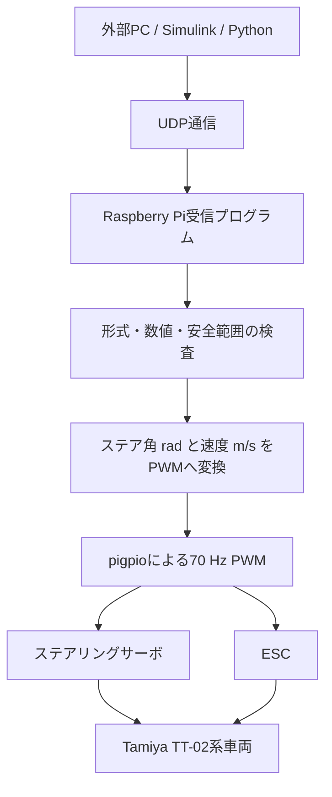

# modecar 車両・ソフトウェア概要

最終確認日: 2026-07-13

## 1. この文書における `modecar` の意味

このリポジトリには、`modecar` という名前のファイル、クラス、モジュール、または正式製品名は存在しない。

一方で、次の関連名称が確認できる。

- 過去コードの著作権表記: `MODECO` / `MODECO LLC`
- 車両・エンコーダキットの表記: `ADRC-CAR`
- 車体: Tamiya TT-02系
- リポジトリ名: `OpenMiniCarWorks`

そのため、この文書ではユーザー指定の `modecar` を、OpenMiniCarWorksで扱っているRaspberry Pi搭載RCカー全体の便宜上の呼称として使用する。
MODECOと車両の正式な関係や、`modecar`が正式名称かどうかは、リポジトリ内の情報だけでは確定できない。

また、自律走行用コードや過去のMPC実験記録は存在するが、現在それらが常用されているとは仮定しない。
現在の主な引き継ぎ対象は、ステアリング校正とステアリング指令の検証である。

## 2. プロジェクト概要

OpenMiniCarWorksは、RCカーをオープンな実験プラットフォームとして扱うための、ソフトウェア、実験資料、機械設計データをまとめた作業領域である。

主な対象は次のとおり。

- ステアリングサーボのPWM制御と校正
- ESCとモーターの速度制御
- タイヤエンコーダによる速度・走行距離計測
- LiDARによる周辺計測
- カメラを使った画像処理・色認識
- 外部PCとRaspberry Pi間のUDP通信
- Simulink / Python MPCとの接続実験
- デッドレコニングとPure Pursuitによる経路追従試作
- Raspberry Pi、LiDAR、エンコーダを搭載する機械部品の設計

実機写真:


## 3. 確認できるハードウェア構成

| 項目 | 内容 | 状態 |
| --- | --- | --- |
| シャーシ | Tamiya TT-02系 | 文書に明記 |
| 制御コンピュータ | Raspberry Pi 4 | 文書に明記 |
| 駆動 | ESC + モーター | コード・文書に明記 |
| 操舵 | RCサーボ | コード・文書に明記 |
| エンコーダ | A/B相、36歯 | コードに明記 |
| LiDAR | RPLidar A1M8用試験コードあり | 個別試験段階 |
| カメラ | Picamera / OpenCV用試験コードあり | 個別試験段階 |
| 外部位置計測 | モーションキャプチャーを想定 | 実験計画に記載 |

ESC、モーター、サーボ、カメラ、エンコーダの正確な型番と電気仕様を一括して示すBOMは、現在のリポジトリにはない。
コネクタの端子順や電源仕様を、写真や線色だけから推定してはならない。

## 4. 制御構成

標準化を目指している外部PC制御系は次の構成である。



別の試作系として、タイヤエンコーダとPure Pursuitを使う楕円走行MVPも存在する。

```text
odometer
  -> dead-reckoning localizer
  -> reference path
  -> Pure Pursuit
  -> car driver
```

ただし、UDP系と楕円走行系ではGPIO番号、PWM表現、校正値が異なるため、そのまま混在させてはならない。

## 5. 現行ステアリング校正

### 5.1 対象プログラム

現行の確認プログラム:

```text
scripts/device_test/rccar_tests/test_PWM/pigpio/steering_check.py
```

通常状態では次の設定になっている。

```python
USE_HARDWARE = False
```

この状態では、目標角度から計算したPWM duty比[%]を表示するだけで、GPIOや実車へ出力しない。
Raspberry Pi専用の`pigpio`も、実機モードに入るまで読み込まない。

### 5.2 角度の単位と方向

- 目標角度リストと実測表示: 度 `[deg]`
- 変換式と制御内部: ラジアン `[rad]`
- 正のステア角: 左方向
- 負のステア角: 右方向
- duty比を小さくする: 左方向
- duty比を大きくする: 右方向

ステアリング方向については、過去の実機記録で次が確認されている。

```text
+15 deg = +0.261799 rad -> 左
-15 deg = -0.261799 rad -> 右
```

### 5.3 現在の変換式

現在はパルス幅ではなく、70 Hz PWMのduty比[%]を直接使っている。

```text
steer_angle_rad
    = -0.186785136654 * steering_duty_percent
      + 2.018473280947
```

制御時の逆変換:

```text
steering_duty_percent
    = (target_steer_rad - 2.018473280947)
      / -0.186785136654
```

コード上の係数:

```python
DUTY_FIT_A = -0.186785136654
DUTY_FIT_B = 2.018473280947
```

### 5.4 確認角度と計算値

| 目標角度 [deg] | 目標角度 [rad] | 指令duty比 [%] |
| ---: | ---: | ---: |
| +18.0 | +0.314159 | 9.124462718 |
| +9.4 | +0.164061 | 9.928050831 |
| 0.0 | 0.000000 | 10.806391328 |
| -9.0 | -0.157080 | 11.647355633 |
| -18.0 | -0.314159 | 12.488319939 |

### 5.5 中立値と線形式のゼロ点

実車で確認したステアリング中立候補:

```text
steering neutral duty = 10.895 %
```

線形近似式から計算されるゼロ角度指令:

```text
target_steer_rad = 0.0 rad
steering_duty_percent = 10.806391330 %
```

両者の差:

```text
0.088608670 %
```

70 Hz PWMでは約 `12.66 us` の差に相当する。
実測中立 `10.895 %` を現在の線形式へ入力すると、式上では約 `-0.0166 rad`、約 `-0.95 deg`になる。

そのため、現在は次を区別する。

- `10.895 %`: 手動中立、緊急停止、終了処理に使う実測中立
- `10.806391330 %`: 現在の線形式が計算する目標角度 `0 rad` の指令

### 5.6 接地状態での実測結果

次の表はすべて角度単位が度 `[deg]` である。

| 条件 | +18.0指令 | +9.4指令 | 0.0指令 | -9.0指令 | -18.0指令 |
| --- | ---: | ---: | ---: | ---: | ---: |
| 浮遊時実測 | +18.0 | +10.0 | 0.0 | -9.9 | -19.0 |
| マット接地時 | +10.0 | +7.0 | 0.0 | -0.5 | -11.0 |
| 板接地時 | +16.0 | +5.5 | 0.0 | -0.5 | -9.0 |

浮遊時には変換式と実測角度が比較的近いが、接地時には操舵角が大きく低下している。
特に `-9.0 deg` 指令は、マット・板のどちらでも約 `-0.5 deg`しか確認できていない。

考えられる要因には、接地摩擦、サーボトルク、リンケージのバックラッシュ、機械的干渉などがあるが、原因はまだ確定していない。

したがって、浮遊時の変換式を走行制御へそのまま使用するのはリスクがある。
走行用には、実際の走行面で旋回半径または曲率を測り、有効ステア角を再同定する必要がある。

自転車モデルを使う場合の関係:

```text
curvature_1pm = 1 / turn_radius_m
effective_steer_rad = atan(wheelbase_m * curvature_1pm)
```

タイヤスリップ、操舵校正誤差、サーボ遅れ、機械的バックラッシュがあるため、このモデルだけで実走を完全には表現できない。

## 6. 現行ステアリング確認のPWM設定

GPIO番号はBCM表記である。

| 項目 | 値 |
| --- | ---: |
| PWM周波数 | 70 Hz |
| ESC信号 | BCM GPIO 12 |
| ステアリング信号 | BCM GPIO 13 |
| ステアリング中立 | 10.895 % |
| ESC中立 | 10.55 % |
| ステアリングduty安全下限 | 7.50 % |
| ステアリングduty安全上限 | 13.00 % |

70 Hzでの参考パルス幅:

| 項目 | duty比 | パルス幅の概算 |
| --- | ---: | ---: |
| ステアリング実測中立 | 10.895 % | 1556.4 us |
| 線形式のゼロ角度 | 10.806391 % | 1543.8 us |
| ESC中立 | 10.55 % | 1507.1 us |

`7.50 %`から`13.00 %`はソフトウェア上のガード範囲であり、全範囲について機械的安全性が実測保証されているという意味ではない。

## 7. ESCと速度変換

### 7.1 現在の実測近似式

前進速度の近似式:

```text
velocity_mps = -2.4618 * esc_duty_percent + 25.347
```

逆変換:

```text
esc_duty_percent = (25.347 - target_velocity_mps) / 2.4618
```

現在の校正では、ESC duty比を中立より小さくすると前進指令が強くなる。

### 7.2 実測データ

| ESC duty比 [%] | 速度 [m/s] |
| ---: | ---: |
| 10.1 | 0.448775 |
| 10.0 | 0.735367 |
| 9.9 | 1.026867 |
| 9.8 | 1.235197 |
| 9.7 | 1.429767 |

この近似式の実測範囲は次である。

```text
0.448775 m/s <= velocity_mps <= 1.429767 m/s
```

一方で、UDP実験では `0.10 m/s`から`0.30 m/s`程度の低速指令を扱っている。
これらは現在の実測範囲外であり、近似式の外挿になる。

停止指令 `0.0 m/s` は近似式で計算せず、ESC中立dutyを直接使用する。

### 7.3 ESC中立値の違い

実験系列によって、次の値が記録されている。

| 系統 | ESC中立duty |
| --- | ---: |
| 現行ステアリング確認 | 10.55 % |
| 標準JSON UDP受信 | 10.55 % |
| 旧Simulink MPC実走記録 | 10.3 % |

これらは車両・ESC・実験条件に依存する校正値であり、同じ値として扱わない。
使用するスクリプト、実配線、ESC設定を確認してから選ぶ必要がある。

## 8. JSON UDP通信

### 8.1 記録されているネットワーク構成

| 機器 | IPアドレス | 役割 |
| --- | --- | --- |
| Raspberry Pi | `192.168.11.4` | 実機I/O側 |
| 外部PC | `192.168.11.5` | 制御計算側 |

| 通信方向 | UDPポート |
| --- | ---: |
| PCからRaspberry Pi | 5005 |
| Raspberry PiからPC | 5006 |

IPアドレスは実験時の記録であり、現在のネットワークでも同じとは限らない。

### 8.2 JSON形式

```json
{
  "target_steer_rad": 0.0,
  "target_speed_mps": 0.0,
  "timestamp": 1782800000.0
}
```

単位:

- `target_steer_rad`: ラジアン `[rad]`
- `target_speed_mps`: メートル毎秒 `[m/s]`
- `timestamp`: UNIX時刻 `[s]`

### 8.3 受信側の安全処理

`UDP/udp_pwm_receiver.py`には次の処理がある。

- UTF-8 / JSON形式の検査
- 必須フィールドの検査
- 数値が有限かの検査
- 負の速度指令の拒否
- ステア角の上限制限
- 速度の上限制限
- 変換後PWM duty比の安全範囲検査
- 不正パケット受信時の中立出力
- UDP途絶時のウォッチドッグ中立
- Ctrl-Cおよび終了処理での中立復帰
- 実機モードでのみ`pigpio`を読み込む遅延インポート

標準初期値:

```text
max steering = +/-0.314159 rad = +/-18 deg
max speed = 0.30 m/s
watchdog timeout = 0.30 s
```

実PWM出力には、安全確認を示す複数の明示オプションが必要であり、デフォルトはドライランである。

## 9. 旧Simulink / Python MPC実験

`docs/senior`には、SimulinkとPython MPCを接続した過去の実験記録がある。
この系統は標準JSONではなく、次の形式を使用していた。

```text
little-endian float64 x 3
packet size = 24 bytes
```

変換用実装:

- `UDP/legacy_double3_rc_adapter.py`
- `UDP/legacy_double3_rc_pwm_receiver.py`

2026-07-08付近の記録では、次が確認されたとされている。

- UDP値の受信とRCカー向け変換
- 駆動輪を浮かせた状態での実PWM出力
- 床上での前進
- ステアリング方向
- 通信途絶時のウォッチドッグ停止
- Ctrl-Cでの中立復帰
- 直進オフセット補正

後半の実験記録にある採用値:

```text
speed_per_legacy_unit = 0.0090
max_speed_mps = 0.38 m/s
legacy_steer_b = 70.9136
ESC neutral duty = 10.3 %
```

これは過去実験の記録であり、現行設定や再実行手順ではない。
標準JSON受信側の初期速度上限 `0.30 m/s` より高く、現在のステアリング確認設定とも異なるため、そのまま流用してはならない。

引き継ぎ文書は追記型で、前半の未解決事項と後半の成功結果が混在している。
この文書だけから、現在MPCランナーが稼働中であるとは判断しない。

## 10. エンコーダと走行距離

エンコーダ関連コードの仮設定:

| 項目 | 値 |
| --- | ---: |
| A相 | BCM GPIO 22 |
| B相 | BCM GPIO 27 |
| 歯数 | 36 |
| タイヤ直径 | 0.066 m |

現行オドメータはA相の立ち上がりだけを数え、36カウントをタイヤ1回転として扱う。

タイヤ直径を `0.066 m` とした場合:

```text
1回転距離 = pi * 0.066 m = 約0.2073 m
1カウント距離 = 約0.00576 m
```

すなわち約 `5.76 mm/count` である。

ただし、タイヤ直径は仮の校正値であり、タイヤ変形、空転、接地荷重などによって実効距離が変わる。
前進時にカウントが正方向へ増えるかも、実配線で確認する必要がある。

Raspberry Pi GPIOは3.3 Vロジックである。
エンコーダ出力が5 Vの場合は、GPIOへ直接接続せず、互換出力または適切なレベル変換を使用する。

## 11. 楕円経路追従MVP

`scripts/ellipse_run`には、外部LiDARやカメラを使わず、タイヤエンコーダと指令操舵角から自己位置を推定し、楕円経路を追従する試作がある。

主な仮設定:

| 項目 | 値 |
| --- | ---: |
| 制御周期 | 50 Hz |
| ホイールベース | 0.250 m |
| タイヤ直径 | 0.066 m |
| 最大ステア角 | 0.489 rad、すなわち28 deg |
| 楕円X半径 | 2.0 m |
| 楕円Y半径 | 1.2 m |
| 目標速度 | 0.4 m/s |
| ステアリングGPIO | BCM 17 |
| ESC GPIO | BCM 18 |

`0.250 m`、`0.066 m`、`0.489 rad`などは実測確定値ではなく、試作コード上の仮校正値である。

現行実装の制約:

- LiDARとカメラは走行制御に使用しない
- エンコーダ距離と指令操舵角だけでデッドレコニングする
- 実速度の閉ループ制御がない
- ESCへ固定パルス幅を出す
- タイヤスリップと操舵誤差が位置・方位ドリフトとして累積する
- `LidarMCLLocalizer`は未実装
- GPIO 17/18を使い、現行ステアリング確認のGPIO 12/13とは異なる

## 12. LiDARとカメラ

### 12.1 LiDAR

RPLidar試験コードでは、デフォルトで次のデバイスを使用する。

```text
/dev/ttyUSB0
```

確認内容:

- デバイス情報
- ヘルス状態
- スキャン取得
- LiDAR停止
- モーター停止
- シリアル切断

機械データには、RPLidar A1M8、A2M6、A2M8の資料とLiDAR取付ベースがある。
ただし、LiDARを使った自己位置推定は現在の走行制御へ統合されていない。

### 12.2 カメラ

カメラ関連には次の試験・サンプルがある。

- OpenCVによるカメラ取得
- Picameraによる取得
- 色検出
- HSVしきい値調整
- デモ走行用の画像処理

これらは主に個別試験または旧サンプルであり、現行ステアリング確認には接続されていない。

## 13. 機械設計データ

`mechanical/TT02Parts`には、TT-02へRaspberry Piやセンサを搭載するための機械データがある。

主な部品:

- メインフレーム
- Raspberry Piベース
- LiDARベース
- エンコーダフレーム
- エンコーダ用歯車
- ベースプレート

主なファイル形式:

- STL
- STEP
- DXF
- Autodesk Inventor IPT
- DWG
- Adobe Illustrator AI
- PDF

設計は`mech_v01`と`mech_v02`に分かれており、エンコーダ取付部やベースプレートの更新履歴がある。

## 14. GPIO・制御方式の比較

GPIO番号はすべてBCM表記である。

| 系統 | ESC | ステアリング | 制御方式 | 既定動作 |
| --- | ---: | ---: | --- | --- |
| 現行ステアリング確認 | 12 | 13 | 70 Hz duty比 | `USE_HARDWARE = False` |
| 標準JSON UDP受信 | 12 | 13 | 70 Hz duty比 | ドライラン |
| 旧Simulink MPC受信 | 12 | 13 | 70 Hz duty比 | ドライラン |
| 楕円追従MVP | 18 | 17 | サーボパルス幅 | `use_hardware = False` |
| エンコーダ | - | - | A相22 / B相27 | Raspberry Pi専用 |

GPIO設定はスクリプト固有である。
実機を動かす前に、使用するスクリプトのGPIO、中立値、PWM周波数、信号方式と実配線を必ず照合する。

## 15. 車両寸法について

車両寸法資料には、測定方法の例として次の値が記載されている。

```text
wheelbase = 0.235 m
track = 0.170 m
tire diameter = 0.0685 m
minimum turn radius = 0.469 m
```

一方、楕円追従試作では次を仮定している。

```text
wheelbase = 0.250 m
tire diameter = 0.066 m
```

前者は測定シートの例、後者は試作コードの仮校正値であり、どちらも現在の実車確定値とは断定できない。
制御へ使用する前に、次を実測する必要がある。

- 後輪軸中心から前輪操舵軸中心までのホイールベース `[m]`
- 左右タイヤ中心間のトレッド `[m]`
- タイヤ外径 `[m]`
- 左右前輪の最大操舵角 `[rad]`
- 低速実走時の最小旋回半径 `[m]`

## 16. 現在の到達点と課題

### 16.1 記録上、確認済みの内容

- Raspberry PiからESC・ステアリングへのPWM出力
- ステアリング左右方向
- ESC前進方向
- JSON UDPの双方向通信
- UDP指令からPWM duty比への変換
- 不正指令の安全処理
- UDP途絶時のウォッチドッグ中立復帰
- Ctrl-C・終了処理での中立復帰
- 浮遊時のステアリング角度変換
- 旧Simulink形式による床上前進の実験記録

### 16.2 現在の主要課題

- 接地時に操舵角が大きく低下する原因の特定
- 走行中の有効ステア角と曲率の同定
- ステアリング実測中立と線形式ゼロ点の差の扱い
- 低速域におけるESC速度変換の追加測定
- 車両寸法の実測確定
- GPIO、中立値、PWM方式の系統間整理
- LiDAR自己位置推定の実装
- 標準JSON経路と旧Simulink経路の統合または明確な分離
- 追記型の実験文書に残っている古い状態と新しい状態の整理

## 17. ハードウェア安全要件

- 通常は実車出力を無効にする。
- 最初の確認では駆動輪を床から浮かせる。
- 物理的な電源遮断手段を手元に置く。
- Raspberry Pi、エンコーダ、サーボ電源/BEC、ESC信号のGNDを共通にする。
- Raspberry Pi GPIOへ5 V信号を直接入力しない。
- モーターやステアリングサーボをGPIOまたは3.3 V端子から給電しない。
- コネクタ端子順を線色や写真だけから推定しない。
- `pigpiod`は実車出力時だけ使用する。
- GPIO番号、PWM周波数、中立値を実配線と照合する。
- 接地時に角度が不足しても、確認なしにステアリングduty範囲を広げない。
- 速度上限、スロットル量、パルス幅制限を確認なしに増やさない。
- Ctrl-C、例外、異常パケット、通信途絶時にESCとステアリングを中立へ戻す。
- 床上走行は、低速、短時間、広い場所、物理停止可能な状態から始める。

## 18. MODECO表記とライセンス

一部の古いコードには次の表記がある。

```text
Copyright (c) 2023 MODECO
Copyright 2025 @ MODECO LLC
```

機械CAD内部にもMODECOと思われる作業パスが残っている。
このため、一部コードや機械設計がMODECO由来である可能性は高いが、会社情報、製品仕様、販売情報、正式な`modecar`製品名はリポジトリ内にない。

ライセンス表記は次のように混在している。

- リポジトリ直下の`LICENSE`: Unlicense相当
- 一部のMODECOコード: MIT Licenseの個別ヘッダー

再利用時は、リポジトリ全体のライセンスだけでなく、対象ファイルの個別ヘッダーも確認する。

## 19. 主な参照先

### 現行ステアリング

- [`steering_check.py`](../../scripts/device_test/rccar_tests/test_PWM/pigpio/steering_check.py)
- [`steering_duty_angle_data.md`](../PWM/steering_duty_angle_data.md)
- [`steering_conversion_spec.md`](../PWM/steering_conversion_spec.md)
- [`plan.md`](../Steering/plan.md)
- [`vehicle_geometry_measurement.md`](../Steering/vehicle_geometry_measurement.md)

### ESC・速度

- [`esc_speed_conversion_data.md`](../PWM/esc_speed_conversion_data.md)

### UDP

- [`json_udp_spec.md`](../UDP/json_udp_spec.md)
- [`pwm_control_plan.md`](../UDP/pwm_control_plan.md)
- [`json_protocol.py`](../../UDP/json_protocol.py)
- [`udp_pwm_receiver.py`](../../UDP/udp_pwm_receiver.py)

### エンコーダ・経路追従

- [`show_encoder_state.py`](../../scripts/device_test/rccar_tests/test_encoder/show_encoder_state.py)
- [`speed_observer_mp.py`](../../scripts/device_test/rccar_tests/test_encoder/speed_observer_mp.py)
- [`ellipse_run/README.md`](../../scripts/ellipse_run/README.md)
- [`ellipse_run/TEST.MD`](../../scripts/ellipse_run/TEST.MD)
- [`run_ellipse.py`](../../scripts/ellipse_run/run_ellipse.py)

### 旧Simulink / MPC実験

- [`simulink_raspberry_udp_handoff.md`](../senior/simulink_raspberry_udp_handoff.md)
- [`current_vehicle_mpc_experiment_plan.md`](../senior/current_vehicle_mpc_experiment_plan.md)
- [`mpc_udp_send_limit_issue_2026-07-08.md`](../senior/mpc_udp_send_limit_issue_2026-07-08.md)

### 機械データ・写真

- [`mechanical/Photo`](../../mechanical/Photo)
- [`mechanical/TT02Parts`](../../mechanical/TT02Parts)

## 20. まとめ

このリポジトリで扱う`modecar`は、Tamiya TT-02系シャーシへRaspberry Pi 4、ESC、RCサーボ、A/B相エンコーダ、LiDAR、カメラなどを搭載した研究・実験用RCカーと整理できる。

現在もっとも重要な技術課題は次の2点である。

1. 浮遊時に合うステアリング変換が、接地時には大きくずれること。
2. スクリプトごとにGPIO、中立値、PWM方式、校正値が異なること。

走行制御へ進む前に、マット上での有効ステア角、低速域のESC特性、車両寸法、実配線を再確認し、浮遊時校正と走行用校正を分けて管理する必要がある。
