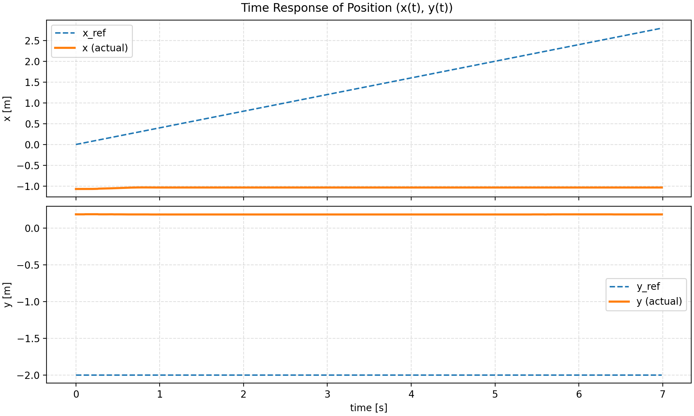

# 先輩Notebook セル確認記録

更新日: 2026-07-13

## 目的

先輩のPython Notebook、Simulink、Raspberry Pi 4を使用した実験について、Notebookのセルを一つずつ確認する。

現在確認している実験の目標は次のとおり。

- 参照軌道に基づいて実車を直線走行させる。
- 目標位置で停止させる。
- 実車位置、参照位置、制御入力のグラフを出力する。
- シミュレーション結果と実車結果を比較する。

現在の主な問題は、実機想定モードで速度指令の大半が負値になり、Raspberry Pi側の安全制限によって速度が `0.0 m/s`、ESCが中立となるため、実車が一瞬だけ前進して停止することである。

## 記録方針

各セルについて、次の内容を記録する。

1. セルの役割
2. 現在の問題との関連度
3. 正常・疑わしい・追加確認が必要のいずれか
4. 次に追跡すべき変数や処理
5. シミュレーション用、実機用、または共通処理の区分

関連度は次の4段階で記録する。

- **直接関係あり**
- **間接的に関係あり**
- **関係なし**
- **追加情報が必要**

Notebookの全体構造が判明するまでは、各セルを単独で断定せず、後続セルとのデータフローが分かった時点で判定を更新する。

---

## 項目1: ライブラリと環境のセットアップ

### セル内容

```python
import os, sys, subprocess


def ensure(pkg, import_name=None):
    """pkg が無ければ静かに pip インストールして import する"""
    import_name = import_name or pkg
    try:
        __import__(import_name)
    except ModuleNotFoundError:
        subprocess.check_call([sys.executable, "-m", "pip", "install", "-q", pkg])
        __import__(import_name)


ensure("casadi", "casadi")
ensure("matplotlib", "matplotlib")
ensure("numpy", "numpy")

import numpy as np
import casadi as ca
print("Python:", sys.version.split()[0])
print("Interpreter:", sys.executable)
print("CasADi:", ca.__version__)
```

### 役割

MPC計算とグラフ作成に必要なPythonライブラリを準備し、実行環境を表示するセルである。

- `NumPy`: 配列および数値計算
- `CasADi`: MPCの最適化問題、車両モデル、数値計算
- `Matplotlib`: グラフ表示
- `sys.executable`: Notebookが使用しているPythonインタープリターの確認
- `ca.__version__`: CasADiバージョンの確認

不足しているパッケージがある場合は、Notebookが使用しているPython環境へ `pip install` を実行する。

### 関連度

**間接的に関係あり**

このセルは参照軌道、実車位置、姿勢、速度指令、停止判定、Simulink通信、UDP送信、GPIO出力を扱わない。そのため、現在発生している負速度や「一瞬前進して停止する」現象の直接原因ではない。

一方で、CasADiは後続のMPC計算に使用される可能性が高いため、先輩の環境と現在の環境の再現性を確認するうえでは関係がある。

### 判定

**セルの記述は現時点で正常。負速度の直接原因ではない。**

次の修正は妥当である。

```python
ensure("casadi", "casadi")
import casadi as ca
```

`ca`はインストールまたは直接importするモジュール名ではなく、`casadi`をimportした後に使用する別名である。

### 注意点

パッケージのバージョンが固定されていないため、新規インストール時には先輩が使用したバージョンと異なる可能性がある。

```python
subprocess.check_call([
    sys.executable,
    "-m",
    "pip",
    "install",
    "-q",
    pkg,
])
```

通常、CasADiのバージョン差だけで速度指令の符号が反転する可能性は低い。ただし、次の点に影響する可能性はある。

- 最適化ソルバーの挙動
- 数値誤差や収束条件
- 最適化失敗時の処理
- APIや配列形状の互換性

また、セルを実行すると不足パッケージが自動インストールされ、Python環境が変更される可能性がある。GPIOや車両を動作させる処理は含まれていない。

### 未確認情報

実際に表示された次の値はまだ提示されていない。

```text
Python: 未確認
Interpreter: 未確認
CasADi: 未確認
```

先輩の実行環境が別途判明した場合は、これらの値と比較する。

### 次に追跡する内容

このセルから直接追跡する制御変数はない。後続セルで次の処理を確認する。

- MPCモデルおよび最適化問題の定義
- サンプリング周期
- 状態ベクトルと制御入力の順序
- 参照軌道の生成
- 初期位置および初期姿勢
- 速度指令の計算と符号
- ソルバー失敗時の値の扱い

### 区分

**シミュレーション・実機共通の環境準備処理**

---

## 項目2: シミュレーション時間、車両パラメータ、MPC重み、予測ホライズン

### セル内容

```python
SimTime = 7  # [s]

# 車両パラメータ
L = 0.25  # ホイールベース [m]

# 状態・入力次元
# 状態: [δ, x, y, ψ]
# 入力: [v, δ_dot]
nx = 4
nu = 2

Q = ca.diag([1.0, 10.0, 20.0, 1.0])
R = ca.diag([0.30, 0.30])
Q_f = ca.diag([1.0, 10.0, 20.0, 1.0])

T = 0.4
K = 40
dt = T / K
```

コメントアウトされた別設定も存在する。

```python
Q = ca.diag([4.0, 20.0, 20.0, 2.0])
R = ca.diag([0.10, 0.50])
Q_f = ca.diag([3.0, 20.0, 20.0, 2.0])

T = 0.70
K = 70
```

### 計算される値

```text
SimTime = 7 s
L       = 0.25 m
T       = 0.4 s
K       = 40
Δt      = T / K = 0.01 s
```

予測モデル内部の刻みは `0.01 s`、すなわち100 Hz相当であり、MPCが見る未来の長さは `0.4 s` である。コメントアウトされた `T = 0.70 s`、`K = 70` の設定でも内部刻みは同じ `0.01 s` になる。

### 役割

このセルは次のMPC基本条件を定める。

- 実験またはシミュレーションの総時間
- 車両運動モデルで使うホイールベース
- 状態と入力の次元
- 追従誤差と制御入力に対するコスト重み
- MPCの予測時間と離散化刻み

### 関連度

**直接関係あり。ただし、このセルだけでは原因を確定できない。**

特に、状態ベクトルの順序、速度制約、コスト関数の実装、実際の制御周期は、負速度と目標停止の両方に直接関係する。

### 重要所見1: 状態順序のコメントが矛盾している

セルには次の記述がある。

```python
# 状態: [δ, x, y, ψ]  (位置x, 位置y, 車体方位, 前輪舵角)
```

配列として書かれた順序は次のとおり。

```text
[前輪舵角 δ, 位置 x, 位置 y, 車体方位 ψ]
```

一方、括弧内の日本語をそのまま順番として読むと次になる。

```text
[位置 x, 位置 y, 車体方位 ψ, 前輪舵角 δ]
```

この2通りは一致していない。単なるコメントの誤記であれば動作には影響しないが、状態生成、参照状態、運動方程式、コスト関数で異なる順序を使用している場合、MPCは別の物理量を比較する。その場合は、不自然な操舵だけでなく、負速度を選択する原因にもなり得る。

後続セルで、実装上の状態順序を必ず確認する必要がある。

### 重要所見2: `Q` の意味は状態順序が決まるまで確定しない

```python
Q = ca.diag([1.0, 10.0, 20.0, 1.0])
```

実装上の状態順序が `[δ, x, y, ψ]` なら、重みは次の対応になる。

| 状態 | 重み |
|---|---:|
| 前輪舵角 `δ` | 1.0 |
| 位置 `x` | 10.0 |
| 位置 `y` | 20.0 |
| 車体方位 `ψ` | 1.0 |

実装上の状態順序が `[x, y, ψ, δ]` なら、対応は次のように変わる。

| 状態 | 重み |
|---|---:|
| 位置 `x` | 1.0 |
| 位置 `y` | 10.0 |
| 車体方位 `ψ` | 20.0 |
| 前輪舵角 `δ` | 1.0 |

したがって、数値だけを見て重み設定が適切か判断することはできない。直線がどちらの座標軸方向に設定されているかも確認が必要である。

### 重要所見3: `Q_f` は `Q` と同じである

コメントには「終端コスト：位置・姿勢を強めに」とあるが、実際の設定は同一である。

```python
Q   = ca.diag([1.0, 10.0, 20.0, 1.0])
Q_f = ca.diag([1.0, 10.0, 20.0, 1.0])
```

したがって、各成分の係数だけを比較すると終端状態は強められていない。ただし、コスト関数内で `Q_f` に別の倍率を掛けている可能性があるため、後続の目的関数実装を確認するまで最終判断はできない。

これは負速度の符号を単独で説明するものではないが、目標位置での停止精度や予測終端の振る舞いには関係する。

### 重要所見4: 入力コストは速度の正負を区別しない

```python
R = ca.diag([0.30, 0.30])
```

一般的な二次形式 `u.T @ R @ u` で使用される場合、`+v`と`-v`には同じコストが掛かる。この入力コスト自体には、前進を優先して後退を禁止する機能はない。

負速度を防ぐには、後続処理のどこかに少なくとも次のいずれかが必要となる。

- `v >= 0` の最適化制約
- 正の参照速度に対する追従コスト
- 前進のみを扱う別の入力パラメータ化
- 負速度を許可する場合は、ESC後退指令まで含めた明示的な設計

現在のRaspberry Pi受信側は負速度を `0.0 m/s` と中立ESCへ安全制限しているため、Notebook側のMPCが後退可能な設計なら、送受信仕様が一致していない。

### 重要所見5: ホイールベースは新しい実車では仮値

```python
L = 0.25  # [m]
```

`0.25 m`は現在の資料でも仮のホイールベースとして扱われている。実測値と異なる場合、速度符号を直接反転させる可能性は低いが、次に影響する。

- 同じ舵角に対する予測曲率
- 方位予測
- 軌道追従誤差
- 停止位置へ至る予測状態
- シミュレーションと実車の差

新しい実車で、前輪車軸中心から後輪車軸中心までをSI単位のメートルで実測する必要がある。

### 重要所見6: 予測周期と実通信周期の一致が未確認

```python
dt = 0.01  # [s]
```

これは予測モデル内部では100 Hz相当である。しかし、次の周期が同じとはまだ確認できていない。

- NotebookのMPC更新周期
- モーションキャプチャーの更新周期
- PythonとSimulinkのデータ交換周期
- Simulinkのサンプル時間
- Raspberry PiへのUDP送信周期

内部モデルが `0.01 s` ごとに進む前提なのに、実測状態の更新や実車への指令がそれより大幅に遅い場合、予測と実車の時間軸が一致しなくなる。これは追従性能と停止精度に影響する。

### `SimTime = 7 s` について

総時間 `7 s` は実験終了時刻を決める可能性があるが、参照軌道の長さ、目標位置、速度、停止判定が未提示のため適否はまだ判断できない。

例えば速度上限を `0.30 m/s` とする現行の安全設定では、加減速を無視した7秒間の最大走行距離は約 `2.1 m` である。ただし、Notebookが想定する速度範囲は後続セルで確認する必要がある。

### 現時点の判定

**要重点確認。コード値だけで即座に誤りとは断定できないが、現在の負速度問題に関係し得る不整合がある。**

優先度は次のとおり。

1. 状態ベクトルの実装上の順序
2. 速度 `v` の上下限制約
3. 状態誤差と終端コストの実装
4. 参照状態の順序
5. 初期位置・初期方位と参照軌道始点の関係
6. MPC、Simulink、モーションキャプチャー、UDPの周期
7. 新しい実車のホイールベース実測値

### 次に追跡する変数と式

- 状態変数 `X`、`x`、`states`、`x0`、`x_ref`
- 入力変数 `U`、`u`、`controls`
- 速度 `v` の制約 `lbx`、`ubx`、`lbg`、`ubg` または `opti.subject_to`
- 状態誤差を作る式
- `Q`、`R`、`Q_f`を使用する目的関数
- 車両運動方程式における各状態の添字
- 実測状態からMPC状態への並べ替え
- `dt`を使用する積分式
- 制御ループの待ち時間やSimulinkサンプル時間

### 区分

**シミュレーション・実機共通のMPC設定。ただし、`L`と周期は実機適合性に直接関係する。**

---

## 項目3: 車両運動モデル `make_f()`

### セル内容

```python
def make_f():
    states = ca.SX.sym("states", nx)
    ctrls = ca.SX.sym("ctrls", nu)

    phi = states[0]
    x = states[1]
    y = states[2]
    psi = states[3]

    v = ctrls[0]
    omega = ctrls[1]

    phi_dot = v / L * ca.tan(psi)
    x_dot = v * ca.cos(phi)
    y_dot = v * ca.sin(phi)
    psi_dot = omega

    states_dot = ca.vertcat(phi_dot, x_dot, y_dot, psi_dot)

    f = ca.Function(
        "vehicle_dynamics",
        [states, ctrls],
        [states_dot],
        ["x", "u"],
        ["x_dot"],
    )
    return f
```

### 役割

CasADiの記号変数を使って、MPCの予測に使用する連続時間の運動方程式を定義する関数である。モデルは前輪舵角を状態に含む、運動学的な自転車モデルである。

### 関連度

**直接関係あり**

このモデルは、MPCが正速度と負速度のどちらを選ぶと予測状態が目標に近づくかを決める。さらに、座標系、方位、操舵角の符号が実車・モーションキャプチャーと一致していない場合、現在の負速度や操舵方向の異常に直接つながり得る。

### 実装から確定した状態と入力の順序

運動方程式から、各変数の物理的な意味は次のように確定できる。

```text
states = [φ, x, y, ψ]
       = [車体方位, 位置x, 位置y, 前輪舵角]

ctrls  = [v, ω]
       = [車速, 前輪舵角速度]
```

SI単位は次の想定である。

| 変数 | 意味 | 単位 |
|---|---|---|
| `φ` (`phi`) | 車体方位 | rad |
| `x` | 位置 | m |
| `y` | 位置 | m |
| `ψ` (`psi`) | 前輪舵角 | rad |
| `v` | 車速 | m/s |
| `ω` (`omega`) | 前輪舵角速度 | rad/s |
| `L` | ホイールベース | m |

`omega`は車体のヨーレートではなく、前輪舵角 `psi` の時間微分である。

### 項目2の状態順序に関する判定更新

項目2では状態順序のコメントに矛盾があった。今回の実装に基づく実際の順序は次である。

```text
[車体方位 φ, 位置 x, 位置 y, 前輪舵角 ψ]
```

したがって、項目2の重みは次の対応になる。

| 状態 | `Q`の重み | `Q_f`の重み |
|---|---:|---:|
| 車体方位 `φ` | 1.0 | 1.0 |
| 位置 `x` | 10.0 | 10.0 |
| 位置 `y` | 20.0 | 20.0 |
| 前輪舵角 `ψ` | 1.0 | 1.0 |

この順序が、初期状態、参照状態、実測状態、グラフの列順でも統一されているかは引き続き確認が必要である。

### 運動方程式の意味

```python
x_dot = v * ca.cos(phi)
y_dot = v * ca.sin(phi)
```

この式は次の座標規約を前提とする。

- `φ = 0 rad`かつ`v > 0 m/s`なら、`x`正方向へ前進する。
- `φ = π/2 rad`かつ`v > 0 m/s`なら、`y`正方向へ前進する。
- 方位角は通常の右手系では反時計回りが正になる。

```python
phi_dot = v / L * ca.tan(psi)
```

正速度のとき、正の前輪舵角 `ψ`は方位 `φ`を正方向へ変化させる。標準的な右手系の平面座標なら左旋回に相当する。

```python
psi_dot = omega
```

MPCの第2入力は前輪舵角そのものではなく、前輪舵角の変化速度である。物理ステアリングサーボへ出す場合は、最適化された舵角状態を使うか、`omega`を時間積分して目標舵角を作る必要がある。

### 重要所見1: モデル自体は負速度を許す

この関数には速度の符号制限がなく、`v < 0 m/s`でも数式上は有効である。

- `v > 0 m/s`: 方位 `φ`が向く方向へ前進
- `v < 0 m/s`: 方位 `φ`と反対方向へ移動

そのため、最適化問題に `v >= 0` の制約がなく、現在位置から見て目標が車体後方にあると判定された場合、MPCが負速度を選ぶのはこのモデルでは自然な結果である。

現在のRaspberry Pi側は負速度を中立ESCへ制限するため、Notebookが後退を許す設計なら、Notebookのモデル仕様と実車受信側の仕様が一致していない。

ただし、このセルには最適化制約が含まれないため、実際に負速度が許可されているかは後続の制約定義を確認して確定する。

### 重要所見2: モーションキャプチャーとの座標規約一致が必須

次のいずれかが異なると、MPCが実車の前後や左右を誤認する。

- モーションキャプチャーの `x`、`y` 軸とモデルの `x`、`y` 軸
- `φ = 0 rad`が示す実車の向き
- 方位角の正方向が反時計回りか時計回りか
- モーションキャプチャーの角度範囲とアンラップ処理
- 参照軌道の座標原点

例えば、実車がモデル上の `x`正方向を向いているつもりでも、モーションキャプチャーから `φ ≈ π rad`と渡されれば、モデルは実車が逆向きだと判断する。後退が許可されていれば、目標へ近づくために負速度を選ぶ可能性が高い。

これは、現在観測されている「実機想定モードで速度指令の大半が負値」という現象の有力候補である。

### 重要所見3: 操舵の符号規約

モデル上では、正速度時に次の関係になる。

```text
ψ > 0 rad → φが増加 → 標準座標系では左旋回
ψ < 0 rad → φが減少 → 標準座標系では右旋回
```

実車サーボの正方向、旧形式の `raw3`変換、モーションキャプチャーの方位正方向がこの規約と一致するか確認する必要がある。

現在使用している旧形式変換には別の符号規約が含まれる。

```text
target_steer_deg = -0.8246 * raw3 + legacy_steer_b
```

このNotebookの `psi`または`omega`がどのように`raw3`へ変換されるかを追跡しなければ、操舵方向の整合性は判断できない。

### 重要所見4: 制御入力は舵角ではなく舵角速度

第2入力について、セルのコメントは`ω`としているが、式から意味は明確に前輪舵角速度である。

```python
psi_dot = omega
```

後続処理で次を確認する必要がある。

1. 最適化で得た`omega`を積分しているか。
2. 予測状態の`psi`を目標舵角として使用しているか。
3. `omega [rad/s]`を誤って操舵角`[rad]`としてSimulinkや実車へ送っていないか。

もし`omega`を直接ステアリング角として送っている場合は、単位と物理量が一致せず、操舵指令異常の原因になる。ただし、送信セルが未提示のため現時点では未確定である。

### 重要所見5: `x, y`が表す車体基準点

この運動方程式は一般に、`x, y`を後輪車軸中心の位置、`v`をその点の車体前方向速度として扱う形である。

モーションキャプチャーのマーカー中心が車体中央、車体上部、前方、後方など別の点にある場合、マーカー位置をそのまま`x, y`へ入れるとモデルの基準点と一致しない。直線走行中の影響は旋回時より小さいが、次には影響する。

- 参照軌道始点との位置合わせ
- 目標停止位置の定義
- 旋回時の予測位置
- 実車とシミュレーションの位置比較

マーカー剛体の原点から後輪車軸中心までのオフセットを確認する必要がある。

### 数式自体の判定

**状態の意味を上記のとおり解釈する限り、運動学的自転車モデルとして数式は整合している。**

前輪舵角が実車の安全範囲である約 `±18 deg`、すなわち約 `±0.314 rad`の範囲なら、`tan(psi)`の特異点 `±π/2 rad`から十分離れている。

ただし、次の実機固有値は未検証である。

- `L = 0.25 m`の実測適合性
- 浮遊時の舵角と接地走行時の有効舵角の差
- タイヤ横滑りと機械的バックラッシュ
- モーションキャプチャー原点と車体基準点の差

これらの誤差は実車の推定姿勢・位置に蓄積し、シミュレーションとのずれを生む。

### 現時点の判定

**モデル式そのものは妥当だが、負速度を数式上許しており、座標・方位の不一致があると負速度を選び得る。現在の問題に対して重要な確認箇所である。**

現時点の優先確認順は次のとおり。

1. 最適化問題における速度 `v` の下限制約
2. 初期状態および参照状態の並びが `[φ, x, y, ψ]`か
3. モーションキャプチャー方位のゼロ方向と正方向
4. 参照直線がモデル座標のどちらへ進むか
5. `omega [rad/s]`から実車の舵角指令への変換
6. モーションキャプチャーマーカーと後輪車軸中心のオフセット

### 次に追跡する変数と式

- `f = make_f()`の呼び出し
- Runge–Kutta法またはEuler法による離散化
- 状態配列 `X`と参照状態`X_ref`の列順
- 入力配列 `U`の上下限制約
- `v_min`、`v_max`、`omega_min`、`omega_max`
- 最適解から実際に送信する値を取り出す処理
- `psi`または`omega`をSimulinkへ渡す処理
- モーションキャプチャー値の並べ替えと座標変換

### 区分

**シミュレーション・実機共通の車両予測モデル。座標規約、車体基準点、操舵変換は実機接続に直接関係する。**

---

## 項目4: RK4による車両モデルの離散化

### セル内容

```python
def make_F_RK4(f=None, dt_local=None):
    f = f or make_f()

    states = ca.SX.sym("states", nx)
    ctrls = ca.SX.sym("ctrls", nu)

    h = dt_local if dt_local is not None else dt

    k1 = f(x=states, u=ctrls)["x_dot"]
    k2 = f(x=states + 0.5 * h * k1, u=ctrls)["x_dot"]
    k3 = f(x=states + 0.5 * h * k2, u=ctrls)["x_dot"]
    k4 = f(x=states + h * k3, u=ctrls)["x_dot"]

    states_next = states + (h / 6.0) * (k1 + 2 * k2 + 2 * k3 + k4)

    F_RK4 = ca.Function(
        "F_RK4",
        [states, ctrls],
        [states_next],
        ["x", "u"],
        ["x_next"],
    )
    return F_RK4
```

### 役割

項目3の連続時間車両モデルを4次のRunge–Kutta法（RK4）で離散化し、現在状態と1ステップ分の入力から次状態を計算する。

```text
F_RK4(x_k, u_k) -> x_(k+1)
```

グローバル設定を使う場合のステップ幅は次のとおり。

```text
h = dt = 0.01 s
```

1ステップの間は入力`ctrls = [v, omega]`が一定であると仮定している。これはゼロ次ホールドを仮定した標準的な離散化である。

### 関連度

**間接的に関係あり**

RK4は速度の符号を決めないため、現在の負速度を生成する直接原因ではない。一方、MPCが選んだ負速度をそのまま逆方向の状態変化として予測へ反映する。また、予測刻みと実際の制御周期が一致しない場合は、位置・方位予測と停止精度に影響する。

### 数式の判定

**RK4の実装は標準形と一致しており、現時点で数式上の明確な誤りは見つからない。**

実装されている式は次である。

```text
k1 = f(x,             u)
k2 = f(x + h k1 / 2,  u)
k3 = f(x + h k2 / 2,  u)
k4 = f(x + h k3,      u)

x_next = x + h (k1 + 2 k2 + 2 k3 + k4) / 6
```

CasADi関数を名前付き引数`x`と`u`で呼び、名前付き出力`x_dot`を取得する方法も、項目3の`ca.Function`定義と一致している。

### 重要所見1: 負速度を制限する処理はない

この離散化器には、速度の上下限、飽和、符号制限はない。

例えば次の状態を考える。

```text
φ = 0 rad
x = 0 m
y = 0 m
ψ = 0 rad
omega = 0 rad/s
h = 0.01 s
```

このとき概ね次になる。

```text
v = +1 m/s -> x_next = +0.01 m
v = -1 m/s -> x_next = -0.01 m
```

したがって、後続の最適化問題が`v < 0 m/s`を選べば、この関数は正常に後退運動として予測する。Raspberry Pi側で負速度を`0.0 m/s`へ制限する実機挙動とは、この時点では一致していない。

速度制限は、この後に定義される最適化変数の境界または制約で確認する必要がある。

### 重要所見2: 状態順序に関するコメントは不十分

セル内のコメントには、次の趣旨が書かれている。

```text
[phi, x, y, psi]でも[x, y, psi, delta]でも、make_fと一致させればよい
```

離散化器自体は状態ベクトルの各成分を解釈せず、`make_f()`へ渡すだけなので、その意味では正しい。しかし、Notebook全体としては`make_f()`との一致だけでは不十分である。

次のすべてで同じ順序を使用する必要がある。

- `make_f()`
- 初期状態
- 参照状態
- `Q`および`Q_f`の各重み
- モーションキャプチャーから作る実測状態
- 最適化変数`X`
- グラフ出力
- Simulinkへ渡す配列

このNotebookで項目3の`make_f()`を使用する限り、状態順序は次に固定される。

```text
[φ, x, y, ψ] = [車体方位, 位置x, 位置y, 前輪舵角]
```

後続セルで別順序の状態をそのまま渡すと、RK4はエラーを出さずに誤った物理量として計算する可能性がある。

### 重要所見3: `dt = 0.01 s`と実更新周期の一致

RK4の精度そのものより、MPCが想定する時間と実機の時間が一致しているかが重要である。

モデル上は1回の`F_RK4`呼び出しで`0.01 s`進む。これを予測ホライズンの`K = 40`回適用すれば、合計`0.4 s`の予測となる。

一方、実機で次の処理が例えば`0.05 s`や`0.10 s`ごとにしか更新されない場合、最初の入力だけを適用する実時間とモデルの`0.01 s`が一致しない可能性がある。

- モーションキャプチャー受信
- MPC再計算
- PythonとSimulinkの通信
- SimulinkからRaspberry PiへのUDP送信
- ステアリングサーボおよびESC指令更新

後続の制御ループで、最適解の何ステップ分を使用してから再最適化するか確認する必要がある。

### 重要所見4: 方位角の正規化はない

RK4は方位`φ [rad]`をそのまま積分し、`[-π, π)`などへの正規化を行わない。運動方程式の`sin`と`cos`だけなら問題はないが、コスト関数で単純に次を計算すると、角度境界で大きな誤差になる可能性がある。

```text
φ - φ_ref
```

例えば物理的にはほぼ同じ向きである`+π rad`付近と`-π rad`付近が、数値上は約`2π rad`離れていると評価される。

今回の直線走行で方位が境界をまたがなければ影響は小さいが、モーションキャプチャーの角度表現と参照方位によっては確認が必要である。角度誤差の計算方法は後続のコスト関数で追跡する。

### 重要所見5: `f = f or make_f()`

```python
f = f or make_f()
```

現在想定されている`None`またはCasADi関数を渡す使い方では動作する可能性が高い。ただし、「未指定か」を明示する書き方は次である。

```python
if f is None:
    f = make_f()
```

オブジェクトの真偽値評価に依存しないため、こちらの方が堅牢である。ただし、この記述は負速度の原因ではなく、実行時エラーが発生していないなら今回の停止現象とも関係しない。

### 現時点の判定

**RK4実装は正常と判断する。負速度を作る箇所ではないが、最適化された負速度を後退として正しく予測するため、実車側の前進専用仕様との不一致は残っている。**

現在の問題に対する確認優先度は次のとおり。

1. 最適化に`v >= 0`制約があるか。
2. 初期状態と参照状態が`[φ, x, y, ψ]`順か。
3. MPCを再計算して入力を更新する実周期が何秒か。
4. 方位誤差が角度周期を考慮しているか。
5. 最適解の`v`と`omega`のどのステップを実機へ送るか。

### 次に追跡する変数と式

- `F_RK4 = make_F_RK4(...)`の呼び出し
- 最適化状態`X[:, k+1]`と`F_RK4(X[:, k], U[:, k])`の関係
- `U`の速度上下限
- MPCループの実行周期
- 最適入力列から最初の入力を取り出す処理
- 方位誤差の計算
- モーションキャプチャー更新周期
- Simulinkのサンプル時間

### 区分

**シミュレーション・実機共通の予測モデル離散化。実機では時間刻みと制御更新周期の一致確認が必要。**

---

## 項目5: CasADi組み込みRK積分器 `make_integrator()`

### セル内容

```python
def make_integrator():
    states = ca.SX.sym("states", nx)
    ctrls = ca.SX.sym("ctrls", nu)

    f = make_f()
    ode = f(x=states, u=ctrls)["x_dot"]
    dae = {"x": states, "p": ctrls, "ode": ode}

    I = ca.integrator(
        "I",
        "rk",
        dae,
        {"t0": 0.0, "tf": dt},
    )
    return I
```

### 役割

項目3の連続時間車両モデルを、CasADiの組み込み固定ステップRunge–Kutta積分器へ渡す関数である。

- 積分状態`x`: `states = [φ, x, y, ψ]`
- パラメータ`p`: `ctrls = [v, omega]`
- 積分区間: `0.0 s`から`dt = 0.01 s`
- 積分中の入力: 一定

一般的な呼び出しと結果取得は次の形になる。

```python
result = I(x0=current_state, p=current_control)
next_state = result["xf"]
```

実際の呼び出し方は後続セルで確認する。

### 関連度

**間接的に関係あり**

この積分器は入力された速度の符号を決めず、速度制約も設定しない。そのため負速度を生成する直接原因ではない。一方、`v < 0 m/s`が与えられた場合は、項目3のモデルに従って後退状態を計算する。

### 数式・構成の判定

**CasADiの積分器構成として妥当であり、現時点で明確な実装ミスは見つからない。**

`ctrls`をDAE辞書のパラメータ`p`へ設定しているため、1回の積分区間内では制御入力が一定として扱われる。これは項目4の手書きRK4と同じゼロ次ホールドの考え方である。

状態順序は`make_f()`によって決まるため、次で固定される。

```text
[φ, x, y, ψ] = [車体方位, 位置x, 位置y, 前輪舵角]
```

### 重要所見1: 2種類の離散化器が存在する

Notebookには現在、次の2種類が存在する。

1. 項目4の手書きRK4関数`make_F_RK4()`
2. 項目5のCasADi組み込み積分器`make_integrator()`

両方とも同じ`make_f()`と`dt = 0.01 s`を使うなら、通常は近い結果になる。ただし、CasADiの`rk`プラグインは内部の有限要素数などのオプションを明示していないため、項目4の「1回の手書きRK4」と完全に同じ演算になるとは限らない。

確認すべき点は、どちらが何に使用されているかである。

- MPCの状態遷移制約
- シミュレーションの実状態更新
- 予測軌道生成
- 実機モードの状態更新

例えばMPC内部は`make_F_RK4()`、シミュレーション側は`make_integrator()`という使い分けなら、わずかなモデル差が生じる。直線・短時間では通常小さいと考えられるが、シミュレーションと実車結果を比較するため記録が必要である。

### 重要所見2: 負速度制限はない

このセルにも、次のような前進専用制約は存在しない。

```text
v >= 0 m/s
```

CasADi積分器は最適化制約を設定する場所ではないため、これは積分器の欠陥ではない。速度の下限は、後続のMPC最適化変数`U`に対する境界または制約で定義される必要がある。

MPCが負速度を出した場合の経路は次のようになる。

```text
MPCがv < 0を選択
  -> make_integrator()は後退として積分
  -> NotebookまたはSimulinkが負値を送信
  -> Raspberry Pi受信側が0.0 m/sへ制限
  -> 実車はESC中立となり停止
```

したがって、現在の「一瞬前進して停止する」現象を説明する既知の経路とは整合するが、負速度を最初に選ぶ原因はこのセルではない。

### 重要所見3: `dt`は積分器作成時の値で固定される

```python
{"t0": 0.0, "tf": dt}
```

積分区間は`make_integrator()`を呼び出して`I`を作成した時点の`dt`で構築される。後からグローバル`dt`だけを変更しても、既に作成済みの`I`が自動的に再構築されるとは限らない。

Notebookで`T`、`K`、`dt`を変更した場合は、積分器とMPCソルバーを再作成する必要がある。セルを順不同で再実行すると古い`dt`のオブジェクトが残る可能性があるため、Notebook実行順も確認対象となる。

### 重要所見4: CasADiバージョンによる警告の可能性

CasADiのバージョンによっては、オプション辞書内の`t0`と`tf`指定に非推奨警告が表示される可能性がある。警告が出ても直ちに積分結果が誤るとは限らないが、項目1でCasADiバージョンが固定されていないため、先輩環境との再現性に関係する。

実際に警告や例外が出ていない場合、現在の負速度問題の原因として扱う必要はない。

### 重要所見5: 方位角正規化と実周期の問題は項目4と同じ

この積分器も、明示的に方位`φ`を`[-π, π)`へ正規化しない。コスト関数の角度誤差処理は別途確認が必要である。

また、積分区間は`0.01 s`であるため、実際のMPC更新、モーションキャプチャー、Simulink、UDP送信周期との整合確認が必要である。

### 現時点の判定

**積分器の定義は妥当であり、負速度の直接原因ではない。Notebook内に手書きRK4とCasADi積分器の2系統があるため、後続セルで実際の用途を特定する必要がある。**

確認優先度は次のとおり。

1. MPCの状態遷移制約で使用している積分器
2. シミュレーションの実状態更新で使用している積分器
3. 速度`v`の下限制約
4. 積分器の出力`xf`の状態順序
5. Notebookセルの実行順と`dt`変更後の再構築
6. 実制御更新周期との一致

### 次に追跡する変数と式

- `I = make_integrator()`の呼び出し
- `I(x0=..., p=...)["xf"]`の使用箇所
- `F_RK4 = make_F_RK4()`の使用箇所
- 状態遷移制約を作るループ
- シミュレーション状態を更新する処理
- `U`の速度境界
- ソルバー生成前後のセル実行順

### 区分

**シミュレーション・MPC共通候補の離散積分器。実機を直接操作する処理は含まれない。**

---

## 項目6: 状態・入力の上下限制約

### セル内容

```python
# 状態: [φ, x, y, ψ]
x_lb = [-np.inf, -np.inf, -np.inf, -np.deg2rad(40)]
x_ub = [ np.inf,  np.inf,  np.inf,  np.deg2rad(40)]

# 入力: [v, ω]
u_lb = [-0.1, -0.70]
u_ub = [1.2,   0.70]

total = nx * (K + 1) + nu * K
```

### 役割

MPC最適化で使用する状態と入力の許容範囲、および決定変数の総数を定義するセルである。

実際の配列値が表す範囲は次のとおり。

| 変数 | 下限 | 上限 | 単位 |
|---|---:|---:|---|
| 車体方位`φ` | 制限なし | 制限なし | rad |
| 位置`x` | 制限なし | 制限なし | m |
| 位置`y` | 制限なし | 制限なし | m |
| 前輪舵角`ψ` | `-0.6981` | `+0.6981` | rad（`±40 deg`） |
| 車速`v` | `-0.1` | `+1.2` | m/s |
| 前輪舵角速度`ω` | `-0.70` | `+0.70` | rad/s（約`±40.1 deg/s`） |

現在の`nx = 4`、`nu = 2`、`K = 40`では決定変数の総数は次になる。

```text
状態: 4 × (40 + 1) = 164
入力: 2 × 40       = 80
合計:                 244
```

したがって`total = 244`であり、この計算は正しい。

### 関連度

**直接関係あり。現在の負速度問題を説明する重要な設定である。**

このセルの実際の下限は次である。

```python
u_lb[0] = -0.1  # m/s
```

したがって、定義上はMPCに`-0.1 m/s`までの後退を許可している。負速度がソルバー異常や数値誤差ではなく、許容された最適解として出力され得ることが確認できた。

ただし、この配列が後続のソルバー境界へ正しい順序で適用されているかはまだ未確認である。最終確定には`lbx`、`ubx`または`opti.subject_to`を作るセルが必要である。

### 重要所見1: 速度コメントと実装が一致していない

コメントには次の仕様が書かれている。

```text
v = 車速 [m/s] -> 0〜0.5
```

しかし、実装値は次である。

```text
-0.1 m/s <= v <= 1.2 m/s
```

不一致は両側にある。

| 項目 | コメント | 実際のコード |
|---|---:|---:|
| 最低速度 | `0 m/s` | `-0.1 m/s` |
| 最高速度 | `0.5 m/s` | `1.2 m/s` |

これは単なる説明上の差ではなく、負速度と過大速度の両方に直接関係する。

現在のRaspberry Pi受信側は負速度を安全のため`0.0 m/s`とESC中立へ制限する。そのため、MPCと実車の動作は次のように分かれる。

```text
MPCモデル: -0.1 m/sまで後退可能
実車受信側: 負速度は出力せず0.0 m/sで停止
```

この仕様不一致により、MPCが負速度を選ぶ時間帯に実車が停止することは、現在の観測結果と一致する。

### 重要所見2: 現在の実車速度上限とも一致していない

MPCの上限は次である。

```text
v_max = 1.2 m/s
```

現在の実車試験で使用している受信側安全上限は主に次である。

```text
max_speed_mps = 0.30 m/s
```

MPC上限は実車側上限の4倍である。MPCが`0.30 m/s`を超える指令を出すと、`--allow-limited-output`使用時には受信側で`0.30 m/s`へ制限される。

このため、次の不一致が生じる。

```text
MPCの予測: 指令した速度がそのまま車両へ適用される
実車の動作: 0.30 m/sを超える部分は0.30 m/sへ制限される
```

既存ログで多数確認された`clamped_speed`と整合する設定である。これは安全機能としては正常だが、先輩のMPC出力をそのまま再現している状態ではない。

MPC上限を変更するかどうかは、先輩の旧実機仕様、速度単位、Simulinkでの変換を確認してから判断する。現時点では安全上限を引き上げない。

### 重要所見3: 前輪舵角コメントと実装が一致していない

コメントには前輪舵角の制約が`±30 deg`と書かれているが、実装は`±40 deg`である。

```python
x_lb[3] = -np.deg2rad(40)
x_ub[3] =  np.deg2rad(40)
```

| 項目 | コメント | 実際のコード |
|---|---:|---:|
| 前輪舵角範囲 | `±30 deg` | `±40 deg`（約`±0.698 rad`） |

新しい実車で現在確認している操舵指令は主に`±18 deg`以内であり、接地時の有効角は指令より小さくなることも確認されている。MPCが`±40 deg`まで実現可能と予測すると、実車より大きな曲率を想定する。

これは強制直進でも停止問題が残ったことから、現在の「一瞬前進して停止」の主因ではない。ただし、通常の軌道追従では操舵飽和、方位予測誤差、シミュレーションと実車の差につながる。

実車の操舵安全限界を引き上げてMPCへ合わせることはしない。後で、接地走行による有効舵角・曲率の同定結果を使ってMPC側を実車へ適合させる必要がある。

### 重要所見4: 舵角速度コメントと実装が一致していない

コメントは次の仕様を示している。

```text
ω = ±1.0 rad/s ≈ ±57°
```

角速度なので、正確な単位表記は`deg/s`である。一方、実装は次である。

```text
-0.70 rad/s <= ω <= +0.70 rad/s
```

これは約`±40.1 deg/s`であり、コメントの`±1.0 rad/s`とは一致しない。

| 項目 | コメント | 実際のコード |
|---|---:|---:|
| 舵角速度範囲 | `±1.0 rad/s` | `±0.70 rad/s` |
| 度毎秒換算 | 約`±57.3 deg/s` | 約`±40.1 deg/s` |

この差は負速度には直接関係しないが、操舵応答と予測軌道に影響する。

### 重要所見5: 制約が正しく決定変数へ割り当てられるか未確認

`x_lb`、`x_ub`、`u_lb`、`u_ub`を定義しただけでは、まだソルバーへ制約は適用されていない。後続処理で、決定変数がどの順番に並べられ、各境界がどこへ設定されるかを確認する必要がある。

想定される決定変数の例は次である。

```text
[X(:,0), X(:,1), ..., X(:,K), U(:,0), ..., U(:,K-1)]
```

しかし、実際に次のような別の並びを使う可能性もある。

```text
[X(:,0), U(:,0), X(:,1), U(:,1), ...]
```

配列の並びと境界の並びが一致しなければ、速度境界が別の変数へ適用される可能性がある。負速度が実際に`-0.1 m/s`以内か、さらに下回っているかも判断材料になる。

### 現時点の判定

**MPCはコード上、負速度を意図的に許可している。これはRaspberry Pi側が前進のみを許可している現在の構成と不一致であり、実車が負速度区間で停止する直接的な理由である。**

ただし、「なぜMPCが正速度ではなく負速度を大半の時間で選ぶのか」はまだ未確定である。有力候補は引き続き次のとおり。

1. 実車初期方位と参照方位の不一致
2. モーションキャプチャーとモデルの座標・符号不一致
3. 実車初期位置と参照軌道始点の不一致
4. 状態または参照状態の配列順序不一致
5. 目標位置を通過済みと認識している
6. コスト関数が前進を優先しない

### 安全上の扱い

この確認結果だけを理由に、Raspberry Pi側で後退を有効にしたり、速度上限・操舵上限を引き上げたりしない。まずPC側またはDRYモードで、前進直線実験の全走行区間においてMPCが正速度を継続して出す条件を確認する。

### 次に追跡する変数と式

- `x_lb`、`x_ub`、`u_lb`、`u_ub`から`lbx`、`ubx`を作る処理
- 決定変数のフラット化順序
- 速度解`U[0, :]`の実際の最小値と最大値
- MPC目的関数
- 初期状態`x0`
- 参照状態または参照軌道
- 最適解からSimulinkへ送る速度の変換
- コメント上の`0〜0.5 m/s`が旧仕様か、意図した現仕様か

### 区分

**シミュレーション・実機共通のMPC制約候補。現在の実車安全制限との明確な不一致がある。**

---

## 項目7: 直線参照軌道 `make_reference_traj()`

### セル内容

```python
def make_reference_traj(
    t_eval,
    v_ref=0.4,
    goal_dist=4.0,
    x0=0.0,
    y0=-2.0,
):
    n_steps = len(t_eval)
    x_ref = np.zeros((nx, n_steps))

    for i, t in enumerate(t_eval):
        s = min(v_ref * t, goal_dist)
        x_pos = x0 + s
        y_pos = y0
        phi = 0.0
        psi = 0.0

        x_ref[:, i] = [phi, x_pos, y_pos, psi]

    return x_ref
```

### 役割

時間に応じて`x`正方向へ進み、所定距離に到達した後は同じ位置に留まる直線参照状態を生成する。

デフォルト引数では参照状態は次になる。

```text
開始状態: [φ, x, y, ψ] = [0 rad, 0 m, -2 m, 0 rad]
最終状態: [φ, x, y, ψ] = [0 rad, 4 m, -2 m, 0 rad]
進行方向: x正方向
参照進行速度: 0.4 m/s
```

`goal_dist`は絶対座標ではなく、`x0`からの移動距離である。最終位置は`x = x0 + goal_dist`となる。

### 関連度

**直接関係あり。現在までで最も重要な確認セルの一つである。**

このセルは、MPCが「どこから、どちら向きに、どの速度で、どこまで進むべきか」を決める。実車のモーションキャプチャー状態がこの開始状態と一致していなければ、MPCが負速度や大きな操舵を選ぶ可能性がある。

また、参照の到達時刻と`SimTime`、参照速度と実車速度上限が一致していない。

### 重要所見1: `SimTime = 7 s`では`4.0 m`の目標に到達しない

デフォルト設定で参照が目標距離へ到達する時刻は次である。

```text
t_goal = goal_dist / v_ref
       = 4.0 m / 0.4 m/s
       = 10 s
```

一方、項目2の設定は次である。

```text
SimTime = 7 s
```

`t_eval`が`0 s`から`7 s`までを表す通常の作り方なら、7秒時点の参照移動距離は次になる。

```text
s(7 s) = 0.4 m/s × 7 s = 2.8 m
```

したがって、7秒のシミュレーション中に参照は`goal_dist = 4.0 m`へ到達せず、停止区間にも入らない。7秒時点でも参照は進行中である。

```text
7秒時点の参照状態 ≈ [0 rad, 2.8 m, -2 m, 0 rad]
本来の最終参照状態 = [0 rad, 4.0 m, -2 m, 0 rad]
```

`t_eval`の実際の範囲は未提示なので最終確定には生成セルが必要だが、`t_eval`が`SimTime`から作られるなら、「直線で進んで4 m地点に止まる」という実験を7秒間では確認できない。

### 重要所見2: 明示的な停止判定はない

この関数は、目標距離到達後に参照位置を固定する。

```python
s = min(v_ref * t, goal_dist)
```

`t >= 10 s`では次になる。

```text
x_ref = 4 m
```

しかし、このセルには次のような停止条件はない。

- 目標との距離がしきい値以下なら停止
- 実車速度が十分小さければ終了
- ESC中立指令を明示的に送る
- 位置誤差と時間に基づく終了判定

目標到達後の速度がゼロへ近づくかは、固定された参照位置、入力コスト、MPC制約、制御ループの実装に依存する。実車終了時に確実に中立へ戻す処理は別途必要である。

### 重要所見3: 参照開始姿勢と実車初期姿勢の一致が必須

参照開始状態は固定されている。

```text
φ_ref(0) = 0 rad
x_ref(0) = 0 m
y_ref(0) = -2 m
ψ_ref(0) = 0 rad
```

実車を実験開始時に、モデル座標で次の条件へ合わせる必要がある。

- モーションキャプチャー上の車体基準点が`(x, y) = (0 m, -2 m)`付近
- 車体前方がモデルの`x`正方向
- 車体方位が`φ = 0 rad`付近
- 前輪舵角が`ψ = 0 rad`付近

または、実車の初期実測状態に合わせて参照軌道全体を座標変換する必要がある。

例えば実車の初期`x`が参照より前方にあり、MPCが位置誤差を減らすため後方へ動く方が近いと判断すれば、項目6で許可されている負速度を選択できる。

固定された`y0 = -2.0 m`も重要である。実車が別の`y`位置にある場合、項目2で`y`誤差の重みが`20.0`と大きいため、強い横方向修正を要求する可能性がある。

この初期位置・初期方位の不一致は、現在の負速度と操舵飽和の有力原因である。

### 重要所見4: 参照速度が現在の実車上限を超える

参照軌道は時間に対して次の速度で進む。

```text
v_ref = 0.4 m/s
```

現在のRaspberry Pi受信側で主に使用している安全上限は次である。

```text
max_speed_mps = 0.30 m/s
```

参照点は実車の許容最高速度より`0.10 m/s`速く進む。このため、実車が安全上限で連続走行しても、理想化すれば1秒ごとに約`0.10 m`ずつ参照から遅れる。

```text
参照の4 m到達時間: 10.0 s
0.30 m/sで4 mを走る最短時間: 約13.3 s
```

加速・減速、通信遅延、タイヤ滑りを考慮すれば実際にはさらに時間が必要である。

これはMPCが`0.30 m/s`を超える速度を要求し、Raspberry Pi側で`clamped_speed`になる要因を説明できる。実車が参照より遅れる場合は通常、追いつこうとして正速度を増やす方向に働くため、負速度が支配的になる理由をこれだけで説明することはできない。負速度については初期状態・座標・参照の渡し方を引き続き確認する。

安全上限を参照速度へ合わせて引き上げることはしない。まず参照軌道とMPC側の条件を、確認済みの実車安全範囲へ合わせる方向で検討する。

### 重要所見5: `v_ref`はMPCの速度入力参照ではない

この関数は状態参照`x_ref`だけを返し、速度入力の参照値は返さない。

```python
return x_ref
```

`v_ref = 0.4 m/s`は参照位置を時間とともに進めるための値であり、MPC入力`v`を直接`0.4 m/s`へ固定するものではない。実際の速度指令は、位置・方位・舵角の誤差と入力コストから最適化される。

そのため、MPCが負速度を出しても、この関数の`v_ref`が直接負になったわけではない。

### 重要所見6: 参照速度は目標地点で不連続にゼロになる

参照位置の時間微分は理想的には次になる。

```text
0 s <= t < 10 s: dx_ref/dt = 0.4 m/s
10 s < t:         dx_ref/dt = 0.0 m/s
```

加速度または減速度のランプはなく、目標地点で移動参照から固定参照へ切り替わる。車両モデルに速度状態はないため数式上は使用できるが、滑らかな減速を明示的に設計した参照ではない。

実車が目標位置で滑らかに停止できるかは、MPCの予測ホライズン`0.4 s`、入力コスト、速度制約、実車のESC特性に依存する。

### 状態順序の判定

```python
x_ref[:, i] = [phi, x_pos, y_pos, psi]
```

これは項目3で確定した車両モデルの状態順序と一致している。

```text
[φ, x, y, ψ]
```

このセル内では、状態順序の誤りは見つからない。

### 現時点の判定

**参照軌道の方向と状態順序は車両モデルに整合している。しかし、初期姿勢の固定値、実験時間、参照速度が現在の実車条件と一致していない可能性が高い。**

確認できた重要事項は次のとおり。

1. 参照は`(0 m, -2 m)`から`x`正方向へ進む。
2. 参照方位は常に`0 rad`。
3. 参照速度は`0.4 m/s`。
4. 目標は`x = 4 m`、`y = -2 m`。
5. 目標到達は`10 s`後。
6. `SimTime = 7 s`なら参照は停止しない。
7. 現在の実車速度上限`0.30 m/s`では参照へ追従できない。

### 次に追跡する変数と式

- `t_eval`の生成範囲と刻み
- `make_reference_traj()`の実際の呼び出し引数
- 実験開始時のモーションキャプチャー`x`、`y`、`yaw`
- モーションキャプチャー値から`[φ, x, y, ψ]`を作る処理
- MPCへ渡す参照ホライズンの切り出し方
- 参照配列の時間インデックス
- 目標到達・停止・ループ終了条件
- 実車用モードで参照原点を補正する処理の有無
- `v_ref = 0.4 m/s`と実車速度変換の対応

### 区分

**シミュレーション・実機共通の直線参照軌道。実車初期位置・方位との位置合わせが必須。**

---

## 項目8: ステージコストと終端コスト

### セル内容

```python
def compute_stage_cost(x, u, x_ref_k, u_ref_k):
    e = x - x_ref_k
    e[0] = ca.atan2(ca.sin(e[0]), ca.cos(e[0]))

    du = u - u_ref_k

    return (
        0.5 * ca.mtimes([e.T, Q, e])
        + 0.5 * ca.mtimes([du.T, R, du])
    )


def compute_terminal_cost(x_T, x_ref_T):
    eT = x_T - x_ref_T
    eT[0] = ca.atan2(ca.sin(eT[0]), ca.cos(eT[0]))
    return 0.5 * ca.mtimes([eT.T, Q_f, eT])
```

### 役割

MPCが各候補軌道を比較する評価関数を定義する。

ステージコストは、各予測ステップで次を評価する。

```text
状態追従誤差: 0.5 eᵀ Q e
入力追従誤差: 0.5 (u - u_ref)ᵀ R (u - u_ref)
```

終端コストは、予測ホライズン最後の状態と終端参照状態の誤差を評価する。

```text
終端状態誤差: 0.5 e_Tᵀ Q_f e_T
```

### 関連度

**直接関係あり**

このコスト関数は、MPCが正速度と負速度のどちらを選ぶと評価値が小さくなるかを決める。特に`u_ref_k`の速度成分が重要であるが、その生成処理はまだ提示されていない。

### 状態誤差の対応

項目3で確定した状態順序と項目2の`Q`から、ステージ状態コストは次の対応になる。

| 添字 | 状態誤差 | 重み |
|---:|---|---:|
| 0 | 車体方位`φ` | 1.0 |
| 1 | 位置`x` | 10.0 |
| 2 | 位置`y` | 20.0 |
| 3 | 前輪舵角`ψ` | 1.0 |

状態順序は`[φ, x, y, ψ]`で一致しており、このセル内に順序の誤りは見つからない。

### 重要所見1: 車体方位誤差の正規化は妥当

```python
e[0] = ca.atan2(ca.sin(e[0]), ca.cos(e[0]))
```

この処理は方位誤差を概ね`[-π, π] rad`の最短角度差へ変換する。項目4と項目5で未確認だった角度境界への対策が、コスト関数側に実装されていることを確認できた。

例えば`+179 deg`と`-179 deg`を単純に引くと`358 deg`になるが、この式では物理的な差に近い約`2 deg`として評価できる。

前輪舵角`ψ`の誤差は正規化していないが、項目6で`±40 deg`に制限される想定であり、`±π rad`の境界をまたがないため通常は問題にならない。

### 重要所見2: `u_ref_k`の値が負速度判定の鍵

入力誤差は次である。

```python
du = u - u_ref_k
```

入力順序は次である。

```text
u = [v, omega]
```

したがって、`u_ref_k[0]`が何かによって速度コストの意味が変わる。

#### `u_ref_k[0] = 0.4 m/s`の場合

参照軌道の進行速度と同じ正速度を中心に評価する。正の`0.4 m/s`が入力コスト上もっとも有利で、負速度には追加コストが掛かる。

ただし、負速度は禁止されない。位置・方位誤差を減らす効果が入力コスト増加より大きければ、項目6の下限`-0.1 m/s`まで負速度を選ぶことができる。

#### `u_ref_k[0] = 0 m/s`の場合

入力コストは速度をゼロへ近づける働きを持つ。正速度と負速度は絶対値が同じなら同じ入力コストとなり、前進を優先する機能はない。

移動する状態参照へ追従するため位置誤差が正速度を要求する可能性はあるが、初期位置や座標がずれていれば負速度も同等に候補となる。

#### `u_ref_k`の列順や単位が誤っている場合

速度と舵角速度の参照が入れ替わっていたり、速度が`m/s`以外の旧形式単位だったりすると、目的関数自体が異なる入力を優先する。

したがって、次に`u_ref`の生成セルを確認する必要がある。

### 重要所見3: 状態コストも前進・後退を直接区別しない

位置誤差は二乗で評価される。

```text
10 (x - x_ref)² + 20 (y - y_ref)²
```

このコストは「前進すべき」という規則を直接持たない。正速度と負速度のどちらが将来の位置誤差を小さくするかは、現在位置、現在方位、参照位置、車両モデルによって決まる。

例えば、参照開始位置が`x_ref = 0 m`なのに実車の初期位置がモデル座標で正側に大きくずれている場合、方位`φ = 0 rad`のまま負速度で`x`を減らすことが、位置コストを減らす最短の方法になり得る。

また、実車方位が参照方向と逆の場合、短い予測ホライズン`0.4 s`の中で旋回するより、許可された負速度を使う方が低コストになる可能性がある。

### 重要所見4: 速度変化そのものへのペナルティはない

```python
du = u - u_ref_k
```

ここでの`du`は、現在入力と参照入力の差であり、前後ステップ間の入力変化ではない。

```text
実装されているもの: u_k - u_ref_k
実装されていないもの: u_k - u_(k-1)
```

車両モデルでは速度`v`が直接入力であり、加速度は状態にも入力にも含まれていない。そのため、最適化上は隣接ステップ間で速度を急に変更できる。

これは次の挙動につながる可能性がある。

- 正速度から負速度への急な切り替え
- 目標付近での速度振動
- 実車ESCの加減速応答と予測モデルの不一致

ただし、現在の負速度が大半を占める原因をこれだけで説明することはできない。まず初期状態、参照状態、`u_ref`を確認する。

### 重要所見5: `Q_f = Q`だが、終端コストは時間倍率の違いで強調される

項目2で確認したとおり、行列の係数は同じである。

```python
Q_f = Q
```

ただし、項目9の目的関数組み立てではステージコストに`dt = 0.01 s`を掛け、終端コストには掛けないことが確認された。

```text
J = Σ(stage_cost × dt) + terminal_cost
```

予測時間は`K × dt = 0.4 s`なので、状態誤差が各時刻で同程度と仮定すれば、ステージ状態コストの時間積分係数は合計約`0.4`、終端コストの係数は`1.0`となる。したがって、行列値自体は同じでも、組み立て全体では終端状態が相対的に強調される。

コメントの「終端で位置・姿勢の行列成分を強めた」という意味では一致しないが、終端予測状態を重視する構成にはなっている。

### 重要所見6: ステージコストへの`dt`倍率は呼び出し側にある

`compute_stage_cost()`関数内には`dt`がないが、項目9で次の呼び出しが確認された。

```python
J += compute_stage_cost(...) * dt
```

したがって、目的関数全体ではステージコストに`dt = 0.01 s`が正しく掛けられている。項目8単独時点の未確認事項は解消した。

`T`を一定にして`K`と`dt`を対応して変更する場合、ステージコストは時間積分に近いスケーリングを保つ。一方、終端コストとの相対関係は予測時間`T`にも依存する。

### 明示的な停止判定について

終端コストは目標位置へ近づける評価であり、実車の停止完了を判定する処理ではない。このセルにも次は含まれない。

- 位置誤差しきい値
- 速度しきい値
- ESC中立への切り替え
- 制御ループの終了条件

停止条件と終了時中立処理は後続セルで確認する。

### 現時点の判定

**コスト関数の基本形と方位角の正規化は妥当である。項目9により`u_ref_k = [0, 0]`と確定し、入力コストは前進速度を優先せず、速度ゼロを中心に正負対称であることが確認された。**

現在の確認優先度は次のとおり。

1. 現在状態と参照ホライズンの対応時刻
2. 実車初期状態と参照開始状態の差
3. 参照配列をソルバーパラメータへ渡す展開順
4. 状態遷移制約と入力境界の適用
5. 最適入力から送信値を作る処理
6. 目標到達・停止判定

### 次に追跡する変数と式

- `compute_stage_cost()`と`compute_terminal_cost()`を使うソルバー構築
- `x_ref_k`を切り出す時間インデックス
- 参照窓を毎回前進させる処理
- 速度入力の前ステップ値を使う処理の有無
- 目標到達後の参照窓

### 区分

**シミュレーション・実機共通のMPC目的関数。負速度選択と停止挙動に直接関係する。**

---

## 項目9: MPCの非線形最適化問題 `make_nlp()`

### セル内容

```python
def make_nlp():
    F_RK4 = make_F_RK4()

    U = [ca.SX.sym(f"u_{k}", nu) for k in range(K)]
    X = [ca.SX.sym(f"x_{k}", nx) for k in range(K + 1)]

    G = []

    ref = ca.SX.sym("ref", nx, K + 1)
    s0 = ca.SX.sym("s0", nx)

    G.append(X[0] - s0)

    J = 0
    for k in range(K):
        u_ref_k = ca.SX.zeros(nu, 1)
        J += compute_stage_cost(X[k], U[k], ref[:, k], u_ref_k) * dt
        eq = X[k + 1] - F_RK4(x=X[k], u=U[k])["x_next"]
        G.append(eq)

    J += compute_terminal_cost(X[-1], ref[:, K])

    option = {
        "print_time": False,
        "ipopt": {"max_iter": 200, "print_level": 0},
    }

    p = ca.vertcat(ca.reshape(ref, -1, 1), s0)

    nlp = {
        "x": ca.vertcat(*X, *U),
        "f": J,
        "g": ca.vertcat(*G),
        "p": p,
    }

    S = ca.nlpsol("S", "ipopt", nlp, option)
    return S
```

### 役割

予測ホライズン全体の状態`X`と入力`U`を決定変数とし、参照窓`ref`および現在状態`s0`をパラメータとして、IPOPTで解く非線形MPC問題を構築する。

### 関連度

**直接関係あり。負速度問題を追跡する中心的なセルである。**

このセルから、MPC内で使用する離散化器、入力参照、決定変数順、参照パラメータ順、等式制約の構造が判明した。

### 確定した構造

#### 決定変数

```text
[X_0, X_1, ..., X_K, U_0, U_1, ..., U_(K-1)]
```

各状態は4要素、各入力は2要素である。

```text
状態変数数: 4 × 41 = 164
入力変数数: 2 × 40 = 80
総数:                   244
```

項目6の`total = 244`と一致する。

#### パラメータ

```text
p = [vec(ref); s0]
```

`ref`は`4 × 41`なので164要素、`s0`は4要素である。

```text
パラメータ総数 = 164 + 4 = 168
```

#### 等式制約

初期状態固定が4本、状態遷移が`4 × 40 = 160`本である。

```text
Gの総数 = 4 + 160 = 164
```

後続のソルバー呼び出しでは、通常すべてに対して次を指定する必要がある。

```text
lbg = 0
ubg = 0
```

### 重要所見1: MPC内部は項目4の手書きRK4を使用する

```python
F_RK4 = make_F_RK4()
```

これにより、MPCの状態遷移制約は項目4の手書きRK4を使用することが確定した。項目5のCasADi組み込み積分器`make_integrator()`は、このNLP内では使用されていない。

`make_integrator()`がシミュレーションの実状態更新に使用されるか、未使用コードかは後続セルで確認する。

### 重要所見2: 入力参照はゼロである

```python
u_ref_k = ca.SX.zeros(nu, 1)
```

入力順序は`[v, omega]`なので、全予測ステップの入力参照は次である。

```text
v_ref_input = 0 m/s
omega_ref   = 0 rad/s
```

項目7の`make_reference_traj(v_ref=0.4)`にある`v_ref`は、参照位置を時間とともに移動させるためだけに使用され、入力参照には渡されないことが確定した。

したがって、入力コストは次の形になる。

```text
0.5 × 0.30 × v² + 0.5 × 0.30 × omega²
```

このコストは速度ゼロを好み、同じ絶対値なら正速度と負速度を同じコストで評価する。前進を優先する作用はない。

移動参照へ追従する正速度は、状態誤差を減らすために選ばれる。現在状態が参照窓より前方にある、方位が逆、または参照が誤って並べられている場合は、負速度が同様に選ばれ得る。

### 重要所見3: ステージコストには`dt`が掛かっている

```python
J += compute_stage_cost(...) * dt
```

項目8の関数内部には`dt`がなかったが、呼び出し側で`0.01 s`を掛けている。これは連続時間コストの時間積分に近い標準的な構成である。

終端コストには`dt`を掛けない。

```python
J += compute_terminal_cost(X[-1], ref[:, K])
```

そのため、`Q_f = Q`であっても終端状態は相対的に強く評価される。誤差が全区間で同程度なら、ステージ状態コストの時間重み合計は約`0.4`、終端は`1.0`である。

### 重要所見4: 現在状態より参照窓終端が前か後ろかが速度符号を左右する

予測ホライズンは`0.4 s`で、参照位置は`0.4 m/s`で進むため、1つの参照窓内では通常、`x`方向に約`0.16 m`進む。

```text
0.4 m/s × 0.4 s = 0.16 m
```

終端コストが相対的に強いため、現在状態`s0`と`ref[:, K]`の前後関係は速度符号へ強く影響する。

- 現在`x`が参照窓終端より後方: 正速度が有利
- 現在`x`が参照窓終端より前方: 負速度が有利になり得る
- 方位が`π rad`近く逆向き: 正速度と負速度の空間的意味が反転

そのため、参照窓が制御時刻とともに正しく前進しているかが非常に重要である。

### 重要所見5: 参照窓が固定されている場合、現在の現象を説明できる

もし後続の制御ループが毎回同じ初期参照窓、例えば`t = 0〜0.4 s`の範囲を渡している場合、参照終端は約`x = 0.16 m`のままになる。

```text
最初: 実車は0 m付近なので正速度を要求
その後: 実車が固定参照窓の前方へ進む
MPC: 固定目標へ戻るため負速度を要求
受信側: 負速度を0.0 m/sへ制限
実車: 一瞬前進して停止
```

これは現在観測されている現象と整合する有力候補である。ただし、実際の参照窓切り出し処理が未提示のため、現時点では仮説である。

次に、制御ループ内で`ref[:, i:i+K+1]`などの時間インデックスを更新しているか確認する必要がある。

### 重要所見6: 参照配列の列優先展開は項目10で正しく実装されている

```python
p = ca.vertcat(ca.reshape(ref, -1, 1), s0)
```

CasADiの行列は列優先でベクトル化されるため、ソルバーが期待する参照順は概念的に次である。

```text
[ref[:,0], ref[:,1], ..., ref[:,K]]
```

各時刻ごとに次が並ぶ必要がある。

```text
[φ_k, x_k, y_k, ψ_k]
```

項目10では、NumPy配列を直接`reshape(-1)`せず、一度`ca.DM`行列に変換してからCasADiでベクトル化している。

```python
ref_dm = ca.DM(ref_window)
p = ca.vertcat(ca.reshape(ref_dm, -1, 1), ca.DM(x_init_list))
```

`ref_window`の形状が正しく`(nx, K+1) = (4, 41)`なら、この展開順はNLP側と一致する。したがって、項目9時点で懸念したNumPyのデフォルト行優先`reshape`問題は、この関数では発生しない。

ただし形状の検証コードはないため、呼び出し側が`(41, 4)`の転置形状を渡していないかは引き続き確認する。

### 重要所見7: 状態・入力境界と等式制約は項目10で適用されている

`nlp`辞書には目的関数、等式制約、パラメータだけが含まれ、境界はソルバー呼び出し時に渡す構成である。

項目10では次をすべて指定していることが確認された。

```python
res = S(
    lbx=lbx,
    ubx=ubx,
    lbg=lbg,
    ubg=ubg,
    x0=x0,
    p=p,
)
```

したがって、次が有効になる。

- 車速`v`: `-0.1〜1.2 m/s`
- 舵角速度`omega`: `-0.70〜0.70 rad/s`
- 予測前輪舵角`psi`: `±40 deg`
- 初期状態固定およびRK4車両運動の等式制約

制約が欠けている可能性は解消した。一方、負速度`-0.1 m/s`までを意図的に許可していることも確定した。

### 重要所見8: 決定変数の境界順は確定した

決定変数は次の順番で連結されている。

```python
ca.vertcat(*X, *U)
```

したがって、境界も必ず次の順番で作る必要がある。

```text
X_0, X_1, ..., X_K, U_0, U_1, ..., U_(K-1)
```

項目6で挙げた交互配置の可能性は、このNLPについては否定された。後続の`lbx`と`ubx`がこの確定順序に一致するか確認する。

### 重要所見9: ソルバー失敗時の処理は別途必要

IPOPT設定は次である。

```text
最大反復回数: 200
出力: 抑制
```

このセルには次の処理はない。

- `S.stats()["success"]`の確認
- `return_status`の確認
- 最適化失敗時の速度ゼロ化
- 前回解を使うかどうかの判断
- NaNまたは無限値の検査

これらはソルバー呼び出し側で確認する必要がある。失敗解や古い解が送信される場合も実機動作へ影響する。

### 現時点の判定

**NLPの基本構成は妥当であり、項目10で参照の列優先展開、変数境界、等式制約、最初の入力抽出が正しく実装されていることを確認した。入力参照がゼロで前進を優先せず、負速度`-0.1 m/s`までを合法な解として許可する点は残る。**

現時点で特に疑わしい順は次である。

1. 参照窓の開始インデックスが制御時刻とともに更新されているか
2. `s0`の状態順と座標・方位
3. `ref_window`の実際の形状が`(4, 41)`か
4. `omega [rad/s]`を実車操舵角へ変換する処理
5. ソルバー成功状態の確認
6. ウォームスタートを次時刻へシフトしているか

### 次に追跡する変数と式

- `compute_optimal_control()`の呼び出し
- `ref_window`の切り出し方と時間インデックス
- `x_init`の生成元
- 制御ループの時刻または参照開始インデックス
- `S.stats()`と失敗時処理
- `u_opt = [v, omega]`からSimulink送信値を作る処理

### 区分

**シミュレーション・実機共通のMPCソルバー定義。参照パラメータの渡し方と制約適用が実車の負速度問題に直結する。**

---

## 項目10: ソルバー実行 `compute_optimal_control()`

### 役割

現在状態、ウォームスタート、参照窓を使って項目9のNLPを解き、予測ホライズン最初の制御入力を返す。

```text
入力:
  S          NLPソルバー
  x_init     現在状態 [φ, x, y, ψ]
  x0         決定変数の初期推定
  ref_window 参照窓、期待形状 (4, 41)

出力:
  u_opt      最初の入力 [v, omega]
  x_opt      最適化した全決定変数
```

### 関連度

**直接関係あり**

この関数は、実際に速度`v`と舵角速度`omega`を計算して返す場所である。境界適用、参照の渡し方、入力抽出が正しいかを判定できる。

### 重要所見1: 変数境界の長さと順序は正しい

境界はNLPの決定変数順と一致している。

```text
X_0: 現在状態に固定                    4要素
X_1〜X_40: x_lb〜x_ub                 160要素
U_0〜U_39: u_lb〜u_ub                  80要素
合計                                      244要素
```

```python
lbx += x_init_list
ubx += x_init_list

for _ in range(K):
    lbx += x_lb
    ubx += x_ub

for _ in range(K):
    lbx += u_lb
    ubx += u_ub
```

この順序は項目9の`ca.vertcat(*X, *U)`と一致する。

したがって、速度境界は実際に次で適用される。

```text
-0.1 m/s <= v <= 1.2 m/s
```

現在観測されている負速度は、制約漏れではなく、この範囲内で許可された最適解である可能性が高い。

### 重要所見2: 等式制約は正しくゼロ固定される

```python
lbg = [0.0] * (nx * (K + 1))
ubg = [0.0] * (nx * (K + 1))
```

長さは`4 × 41 = 164`であり、次の制約数と一致する。

- 初期状態`X_0 = s0`: 4本
- RK4状態遷移: `4 × 40 = 160`本

項目9で未確認だった初期条件と車両運動制約は、ここで有効にされる。

### 重要所見3: 参照のベクトル化方法は正しい

```python
ref_dm = ca.DM(ref_window)
p = ca.vertcat(ca.reshape(ref_dm, -1, 1), ca.DM(x_init_list))
```

`ref_window`が期待どおり`(4, 41)`なら、一度CasADi行列へ変換した後に列優先で展開するため、NLP側の`vec(ref)`と一致する。

したがって、項目9で懸念したNumPyのデフォルト行優先`reshape`問題は、この実装では発生しない。

ただし、関数は形状を検証していない。`ref_window`が誤って転置された`(41, 4)`でも要素数は同じ164なので、ソルバーへ渡せてしまい、参照の意味は崩れる可能性がある。呼び出し側で実際の形状を確認する必要がある。

### 重要所見4: 現在状態は境界とパラメータで二重に固定される

現在状態は次の両方で固定される。

1. `X_0`の下限と上限を`x_init`と同じ値にする。
2. 等式制約`X_0 - s0 = 0`を使い、`s0`にも同じ`x_init`を渡す。

値は同じなので論理的な矛盾はない。制約としては冗長であり、ソルバー状態の確認は必要だが、シミュレーションで正常に解けているなら負速度の主因とは考えにくい。

`x_init`は必ず次の順序・単位である必要がある。

```text
[φ rad, x m, y m, ψ rad]
```

この関数は順序や単位を検証しないため、呼び出し側のモーションキャプチャー変換が重要である。

### 重要所見5: 最初の入力抽出は正しい

```python
offset = nx * (K + 1)
u_opt = x_opt[offset:offset + nu]
```

`offset = 4 × 41 = 164`であり、決定変数内の`U_0`先頭と一致する。

```text
u_opt[0] = v      [m/s]
u_opt[1] = omega  [rad/s]
```

速度の添字間違いは見つからない。

一方、第2要素は前輪舵角`psi [rad]`ではなく、前輪舵角速度`omega [rad/s]`である。後続コードが`u_opt[1]`をそのまま操舵角としてSimulinkや実車へ送ると、物理量と単位が一致しない。次の変換処理を確認する必要がある。

### 重要所見6: `debug=True`でもデバッグ出力はない

引数は次のように定義されている。

```python
debug=True
```

しかしデバッグ表示はすべてコメントアウトされているため、実際には何も表示しない。

現状確認に有用な情報は次である。

- `ref_window.shape`
- `x_init`
- `u_opt`
- `S.stats()["success"]`
- `S.stats()["return_status"]`
- `lbx`、`ubx`、`lbg`、`ubg`の長さ

現時点ではコードを変更せず、後続セルに別のログ処理があるか確認する。

### 重要所見7: ソルバー成功確認と異常値検査がない

```python
res = S(...)
```

の直後に解を使用しており、次を確認していない。

- IPOPTが正常終了したか
- 最大反復回数へ到達していないか
- 解にNaNまたは無限値がないか
- 制約違反が十分小さいか

CasADi設定によっては失敗時に例外となるが、返された解を使用できるケースでもステータス確認が望ましい。現状の負速度が正常最適解か失敗結果かは、`S.stats()`または既存ログで確認する必要がある。

### 重要所見8: ウォームスタートは全解をそのまま返す

```python
return u_opt, x_opt
```

呼び出し側が返された`x_opt`を次回の`x0`へそのまま渡す場合、予測列を1ステップ前へシフトしていない。これは通常、最適解の正しさよりも収束速度や反復回数へ影響する。

実際にどのように再利用しているかは呼び出し側で確認する。

また、渡された`x0`の要素数を明示的に検証していない。`None`または空の場合だけ244要素のゼロベクトルを作る。

### 重要所見9: 参照窓は項目11の呼び出し側で更新される

この関数自体は受け取った`ref_window`をそのまま使用する。項目11の制御ループでは次のスライスが確認された。

```python
ref_window = x_ref[:, i:end_idx]
```

ループ添字`i`とともに開始列が進み、末尾では最後の参照列を複製して`K+1`列に保つ。したがって、毎回同じ初期参照窓を渡している仮説と、通常時に`(41, 4)`形状になる仮説は解消した。

ただし、`i × dt`と実際の状態受信時刻が一致するかは、IPOPT求解時間、Simulink送信周期、UDP受信キューの遅延に依存する。参照窓の配列インデックスは正しく更新されるが、実時間との同期は引き続き確認が必要である。

### 現時点の判定

**境界、等式制約、参照の列優先展開、最初の入力抽出は正しく実装されている。負速度は制約漏れや入力添字ミスではなく、許可範囲内で目的関数が選択している可能性が高い。**

項目11までの確認により、原因候補は主に次へ絞られた。

1. Simulinkから受信する`x_init`の位置・方位が参照開始状態と一致していない。
2. `i × dt`の参照時刻と、UDPで受け取る状態の実時刻が一致していない。
3. IPOPTの求解時間が`dt = 0.01 s`を超え、UDP状態がキューに滞留している。
4. ソルバー失敗結果を確認せず使用している。
5. `omega [rad/s]`をSimulink側で操舵角として誤使用している。
6. Pythonの`single × 6`からRaspberry Pi向け`float64 × 3`へのSimulink変換がMPCの単位と一致していない。

### 次に追跡する変数と式

- 実際に表示された`[FIRST_RX]`
- `solve time`の最小・平均・最大値
- SimulinkからPythonへの送信周期
- Simulink内のモーションキャプチャー座標変換
- `u_opt[0]`と`u_opt[1]`のSimulink内変換
- `S.stats()`または既存のソルバーログ

### 区分

**シミュレーション・実機共通のMPC求解処理。呼び出し側の参照窓と現在状態が負速度問題の次の焦点。**

---

## 項目11: Simulink連携MPC制御ループとUDPストリーミング

### 役割

Simulinkから起動フラグと状態をUDPで受信し、時変参照窓に対してMPCを解き、最初の制御入力と現在状態をSimulinkへUDP送信する。

データフローは次である。

```text
Simulink
  -- UDP single×5 --> Python Notebook
      [flag, φ, x, y, ψ]

Python MPC
  状態受信
  参照窓作成
  IPOPT求解
  u_opt = [v, omega]

Python Notebook
  -- UDP single×6 --> Simulink
      [v, omega, φ, x, y, ψ]

Simulink
  -- 別の変換・UDP経路 --> Raspberry Pi
      little-endian float64×3
```

このセルのPython UDPはRaspberry Piへ直接送る形式ではない。PythonからSimulinkへは`float32 × 6`、確認済みのSimulinkからRaspberry Piへの経路は`float64 × 3`である。間にあるSimulinkの変換処理が重要である。

### 関連度

**直接関係あり。現在の実機問題を確認する最重要セルの一つである。**

このセルにより、参照窓の更新、実測状態の取り込み、実行周期、MPC出力の意味、Simulinkとのパケット仕様が判明した。

### 通信仕様

#### SimulinkからPython

```text
IP: 127.0.0.1
UDPポート: 20000
形式: little-endian float32 × 5
サイズ: 20 byte
順序: [flag, φ, x, y, ψ]
```

#### PythonからSimulink

```text
IP: 127.0.0.1
UDPポート: 5005
形式: little-endian float32 × 6
サイズ: 24 byte
順序: [v, omega, φ, x, y, ψ]
```

想定単位は次である。

| 値 | 意味 | 単位 |
|---|---|---|
| `flag` | 起動フラグ | 無次元 |
| `φ` | 車体方位 | rad |
| `x`, `y` | 位置 | m |
| `ψ` | 前輪舵角 | rad |
| `v` | 車速 | m/s |
| `omega` | 前輪舵角速度 | rad/s |

Simulink側のByte Pack/Unpack、信号順、データ型、エンディアン、単位がこの表と完全に一致する必要がある。

### 重要所見1: 参照窓はループごとに正しく前進する

```python
end_idx = min(i + K + 1, x_ref.shape[1])
ref_window = x_ref[:, i:end_idx]
```

開始インデックスはループ添字`i`とともに進む。末尾で列数が不足すると最後の列を複製して`K+1`列へ補う。

```python
if ref_window.shape[1] < K + 1:
    last_col = ref_window[:, -1][:, None]
    ref_window = np.hstack([
        ref_window,
        np.repeat(last_col, K + 1 - ref_window.shape[1], axis=1),
    ])
```

したがって、項目9・10で疑った次の問題は、配列処理上は発生していない。

- 毎回同じ初期参照窓を使用する
- 通常の参照窓が`(41, 4)`に転置される
- 末尾で`K+1`列未満の参照をソルバーへ渡す

通常時も末尾も、参照窓形状は`(4, 41)`になる。

ただし、参照添字`i`は実時間ではなく「ループで処理した回数」である。後述するUDP遅延や求解時間により、`i × dt`と受信状態の実時刻がずれる可能性は残る。

### 重要所見2: 受信状態を座標変換せず直接MPCへ入れている

```python
_, phi, x_pos, y_pos, psi = res
x_cur = ca.DM([phi, x_pos, y_pos, psi])
```

Python側には次の処理がない。

- 位置原点の移動
- `x`軸と`y`軸の入れ替え
- 軸符号の反転
- 方位ゼロ方向の補正
- 方位正方向の反転
- モーションキャプチャーマーカーから後輪車軸中心へのオフセット補正
- 度からラジアンへの変換

したがって、これらの変換はSimulink側で既に完了していなければならない。

MPC参照開始状態は次である。

```text
[φ, x, y, ψ] = [0 rad, 0 m, -2 m, 0 rad]
```

受信した最初の状態がこの近傍でなければ、MPCは開始時点から大きな誤差を認識する。

コードコメントの表示例は次である。

```text
[FIRST_RX] (1.0, 0.0, 0.0, 1.2, 0.0)
```

これは例示であり実測値とはまだ断定できない。しかし、もし実際の受信値がこの例と同じなら、実車の`y = 1.2 m`に対して参照は`y = -2.0 m`であり、初期横位置誤差は`3.2 m`になる。

```text
y誤差 = 1.2 - (-2.0) = 3.2 m
```

`y`誤差の重みは`20.0`と大きいため、強い操舵・速度指令を生じ得る。現在の負速度と右操舵を調べるため、実際に出力された`[FIRST_RX]`が最優先情報である。

### 重要所見3: Python内の初期状態も参照と一致していない

受信前の初期値は次である。

```python
x_cur = ca.DM([0.0, 0.0, 1.0, 0.0])
```

これは次を意味する。

```text
φ = 0 rad
x = 0 m
y = 1 m
ψ = 0 rad
```

参照開始の`y = -2 m`とは`3 m`異なる。

通常は各ループ先頭のブロッキング受信で有効な状態へ置き換わるため、この初期値が常に使用されるわけではない。しかし、受信パケットが不正サイズまたは展開失敗で`None`になった場合、ループは中断せず、この古い状態のまま最適化を進める。

不正受信時には参照添字だけが前進するため、状態と参照時刻の不一致も起こり得る。

### 重要所見4: 参照は4 m目標へ到達せず、約2.796 mで打ち切られる

```python
t_eval = np.arange(0, SimTime, dt)
```

現在値は次である。

```text
SimTime = 7 s
dt = 0.01 s
len(t_eval) = 700
t_evalの最終値 = 6.99 s
```

参照速度`0.4 m/s`なので、最後の参照位置は次である。

```text
x_ref_final = 0.4 m/s × 6.99 s = 2.796 m
```

`goal_dist = 4.0 m`へ到達するには10秒必要である。したがって、このループは4 m目標を実行せず、最後の約0.4秒では不足参照を最終列で補って、約2.796 mを予測終端として扱う。

これは「4 m先で停止する」実験ではなく、実質的に「7秒で打ち切り、約2.796 m付近を終端として扱う」設定である。

さらに現在の実車安全上限`0.30 m/s`では、7秒で進める理想最大距離は約`2.1 m`であり、2.796 mの参照にも追いつけない。

### 重要所見5: `make_integrator()`は作成されるが使用されない

```python
I = make_integrator()
```

があるが、その後`I(...)`を呼び出していない。Python内で状態を積分せず、毎ステップSimulinkから受信した状態を`x_cur`として使用する。

したがって、項目5のCasADi組み込み積分器はこのループでは未使用コードである。MPC内部の予測には項目4の手書きRK4だけが使われる。

これは負速度の原因ではないが、実装理解とシミュレーション比較のため記録する。

### 重要所見6: `dt = 0.01 s`に対してIPOPT求解時間を確認する必要がある

制御周期は100 Hz相当である。

```text
dt = 0.01 s = 10 ms
```

各ループでIPOPTを解き、求解時間を表示している。

```python
print(f"solve time = {t_solve*1000:.1f} [ms]")
```

安定して実時間同期するには、UDP受信、最適化、パック、送信、ログ、表示を含む1ループが概ね10 ms以内に収まる必要がある。

`solve time`だけで10 msを超える場合、100 Hzでは計算が間に合わない。さらにNotebookへ毎回文字列を表示する処理も実行時間と出力負荷を増やす。

実際の`solve time`の最小値、平均値、最大値、および10 ms超過率が必要である。

### 重要所見7: UDP受信キューの古い状態を処理する可能性がある

起動フラグ受信後に、ソルバーと積分器を構築する。

```python
wait_flag_from_simulink(rx)
run_mpc_and_stream(rx, tx)

# run_mpc_and_stream内
S = make_nlp()
I = make_integrator()
```

Simulinkが起動フラグ後も状態を連続送信する場合、IPOPTソルバー構築中にUDPパケットが受信キューへ溜まる可能性がある。

ループは毎回1パケットだけ受信する。

```python
res = recv_flag_and_state(rx)
```

キューを空にして最新状態だけを選ぶ処理、シーケンス番号、送信時刻はない。そのため、次が起こり得る。

```text
Simulinkは現在状態を送信
Pythonはキュー内の過去状態を受信
MPC参照窓はループ添字iで前進
状態と参照の時刻がずれる
制御指令が遅延する
```

各MPC求解が10 msを超えてSimulinkが100 Hzで送信し続ける場合、制御中にもキュー遅延が増える可能性がある。

これは参照軌道に対して実車が前方または後方にいるとMPCが誤認する原因になり、速度符号へ影響し得る。

### 重要所見8: 壁時計同期だけでは遅延時に追いつけない

```python
next_tick = t0_wall + (i + 1) * dt
remain = next_tick - time.time()
if remain > 0:
    time.sleep(remain)
```

処理が10 ms未満なら待機して周期を合わせる。一方、処理が遅れた場合は待機しないだけであり、古いUDPパケットを捨てたり、参照インデックスを実時間へ合わせて飛ばしたりしない。

また、状態受信はブロッキングでタイムアウトがない。Simulinkの送信周期が`0.01 s`でなければ、ループ添字`i`が表す時間と実時間が一致しない。

確認が必要な周期は次である。

- SimulinkからPythonへの状態送信周期
- IPOPT平均求解時間
- PythonからSimulinkへの指令送信周期
- SimulinkからRaspberry Piへの指令送信周期
- モーションキャプチャー更新周期

### 重要所見9: MPC第2入力は`omega [rad/s]`のまま送られる

```python
v, omega = float(u[0]), float(u[1])
pkt = struct.pack(FMT_TX, v, omega, phi, x_pos, y_pos, psi)
```

PythonからSimulinkへ送る第2値は前輪舵角速度である。Python側では操舵角への積分や変換を行っていない。

Simulink側では、少なくとも次のいずれかが必要である。

- `omega [rad/s]`を積分して目標前輪舵角`psi [rad]`を作る。
- MPC予測状態または受信状態の`psi [rad]`を適切に使う。
- 旧形式`raw3`へ変換する前に、物理量と符号を合わせる。

`omega`を直接操舵角または旧形式`raw3`として扱っている場合、単位不一致になる。Simulinkの`out.PWM`、Byte Pack、UDP Sendまでの信号経路を確認する必要がある。

### 重要所見10: Python・Simulink間とRaspberry Pi向けの24 byteは意味が異なる

PythonからSimulinkへのパケットは次である。

```text
float32 × 6 = 24 byte
[v, omega, φ, x, y, ψ]
```

確認済みのSimulinkからRaspberry Piへのパケットは次である。

```text
float64 × 3 = 24 byte
[raw1, raw2, raw3]
```

どちらも24 byteだが、型・要素数・意味が異なる。バイト数だけでは正しい接続と判断できない。

Simulink内で明示的に`single×6`をUnpackし、MPC出力を必要な旧形式値へ変換し、`double×3`としてPackしていることを確認する必要がある。

### 重要所見11: 起動後は`flag`を無視する

待機中は`flag >= 0.5`で開始するが、制御ループ内では受信した`flag`を捨てている。

```python
_, phi, x_pos, y_pos, psi = res
```

Simulinkが`flag = 0`へ戻して停止を要求しても、Pythonは`700`回のループが終わるまでMPC計算と送信を継続する。

これは負速度の原因ではないが、実験停止と安全動作に関係する。

### 重要所見12: 終了・例外時にゼロ指令を送らない

正常終了時は次を表示して終わる。

```python
print("[DONE] MPC送信を終了")
```

`finally`ではソケットを閉じるだけで、Simulinkへ速度ゼロや中立操舵を明示的に送らない。Ctrl-Cや例外時も同様である。

Raspberry Pi受信側にはwatchdogがあることを確認済みだが、SimulinkがPythonからの最終値を保持したままRaspberry Piへ送信し続ける構成なら、Raspberry Pi側watchdogは通信断を検出できない可能性がある。

実車を再度動かす前に、次を確認する必要がある。

- Python受信停止時にSimulinkが出力を中立へするか。
- SimulinkがRaspberry PiへのUDP送信も停止するか。
- 正常終了、Ctrl-C、例外のすべてで速度・操舵が安全状態になるか。

現時点ではハードウェア出力を実行しない。

### 重要所見13: ソルバー状態・受信値の妥当性検査がない

制御ループには次の検査がない。

- IPOPT成功状態
- `x_cur`のNaN・無限値
- 位置・角度の現実的な範囲
- `u_opt`のNaN・無限値
- UDPシーケンス番号またはタイムスタンプ

受信パケットが不正でも20 byteとして展開できれば、その値をそのままMPCへ入れる。

また、`recvfrom(RX_NBYTES)`は20 byteより長いUDPデータグラムを20 byteへ切り詰める可能性があり、長すぎるパケットを長さ検査だけで検出できない。Simulink送信仕様との一致確認が必要である。

### 重要所見14: ウォームスタートはシフトせず再利用する

```python
u_opt, z0 = compute_optimal_control(S, x_cur, z0, ref_window)
```

返された全最適解`z0`を次のループへそのまま渡す。予測列を1ステップ前へシフトせず、最初の状態推定も前回値のままである。

次回の変数境界と等式制約で新しい`x_cur`へ修正されるため、通常は解の意味を直接壊さないが、初期推定の不整合によりIPOPT求解時間が増える可能性がある。100 Hz実行可否と合わせて確認する。

### 現時点の判定

**参照窓の配列スライスと形状は正しい。一方、MPC状態はSimulink受信値を座標変換なしで使用しており、参照開始状態との一致がコード上保証されていない。さらに、10 ms周期に対するIPOPT求解時間とUDPキュー遅延が未確認である。**

固定参照窓の仮説は否定され、現在の優先確認順は次になった。

1. 実際の`[FIRST_RX] = (flag, φ, x, y, ψ)`。
2. 参照開始`[0 rad, 0 m, -2 m, 0 rad]`との誤差。
3. `solve time`の平均・最大・10 ms超過率。
4. SimulinkからPythonへの送信周期とUDP滞留。
5. Simulink内の座標・方位変換。
6. `omega [rad/s]`から操舵角・`raw3`への変換。
7. Python終了時のSimulinkおよびRaspberry Pi中立化。
8. 4 m目標、7秒、参照`0.4 m/s`、実車上限`0.30 m/s`の不一致解消。

### 次に必要な出力・セル

- 実際に表示された`[FIRST_RX]`行
- `solve time`の代表値またはログ
- Simulink内のPython UDP Receive後の信号処理
- `v`と`omega`から`out.PWM`または`raw1/raw2/raw3`を作る部分
- モーションキャプチャーから`[φ, x, y, ψ]`を作る部分
- グラフ生成セルと`X_log`、`U_log`の出力

### 区分

**実機・シミュレーション共通のリアルタイム連携ループ。実機安全、座標整合、周期整合、停止動作に直接関係する。**

---

## 項目12: 到達時刻計算と軌道・時系列グラフ

### 役割

MPC実行後のログから、参照終端位置への到達時刻、位置RMSE、XY軌道、位置・角度・入力の時系列を計算・表示する。

このセルは制御指令を生成せず、UDPやGPIOも操作しない。現在の問題を診断し、実験結果を評価するための後処理である。

### 関連度

**直接的な制御原因ではないが、実験結果の判定方法には直接関係する。**

特に、コード上の「ゴール」が`goal_dist = 4.0 m`ではなく、7秒で打ち切られた参照配列の最終点になっていること、到達判定時間が実時間ではなく`t_eval`の公称時間であること、`U_log`が実車適用値ではなくMPC要求値であることが重要である。

### 保存済みグラフ

このセルで保存されたグラフを確認した。



### 重要所見1: 判定しているゴールは4 m地点ではない

到達判定のゴールは参照配列の最後の列である。

```python
gx, gy = xr[-1], yr[-1]
```

項目11で確認したとおり、現在の参照配列は`t = 6.99 s`で終了するため、ゴールとして使われる座標は次である。

```text
gx = 約2.796 m
gy = -2.0 m
```

元の参照生成引数にある本来の距離目標は次である。

```text
goal_dist = 4.0 m
```

したがって、この到達判定が`Reached`になっても、「4 m地点へ到達した」ことにはならない。約`(2.796 m, -2.0 m)`へ到達したという意味である。

### 重要所見2: 保存グラフから大きな初期座標ずれを確認

`xy_timeseries.png`を目視確認すると、概ね次の値が示されている。

```text
参照開始: x = 0 m、y = -2 m
実測開始: x ≈ -1.05 m、y ≈ 0.18 m
```

これは画像からの概算であり、正確な値には`X_log`本体または`[FIRST_RX]`が必要である。

概算の初期誤差は次である。

```text
x誤差 ≈ -1.05 m
y誤差 ≈ +2.18 m
位置誤差ノルム ≈ 2.42 m
```

参照と実測が同じ座標系・原点を共有しているとは考えにくい大きさである。項目11で疑っていた「モーションキャプチャー状態と参照軌道の初期位置合わせがない」という問題を、グラフ上でも確認できた。

特に参照`y = -2 m`に対して実測`y ≈ 0.18 m`がほぼ一定であり、約`2.18 m`の横方向オフセットがある。`y`誤差のコスト重みは`20.0`なので、MPCにとって非常に大きな誤差となる。

### 重要所見3: 実測位置はほとんど移動していない

保存グラフでは、7秒間にわたり実測値が概ね次の範囲でほぼ一定に見える。

```text
x_actual ≈ -1.05 m付近
y_actual ≈  0.18 m付近
```

一方、参照`x`は`0 m`から約`2.8 m`まで増加する。これは「実車が一瞬だけ動いて停止した」または「位置計測上ほとんど移動していない」という既知の状況と整合する。

位置グラフだけでは停止原因が負速度制限か、通信遅延か、座標変換かを分離できない。`U_log`の速度、Raspberry Pi受信ログの`negative_speed`・`clamped_speed`、実際のPWM適用状態との時刻対応が必要である。

### 重要所見4: 位置だけなら正速度が必要だが、実際には負速度が多い

グラフ上では、実測`x ≈ -1.05 m`は参照`x >= 0 m`より負側にある。もし車体方位が`φ = 0 rad`でモデルの`x`正方向を向いているなら、位置`x`の誤差だけを減らすには正速度が必要である。

それにもかかわらず実機想定モードで負速度が支配的だったため、次のいずれかがさらに疑われる。

- 受信方位`φ`が`π rad`付近で、モデル上は逆向きになっている。
- モーションキャプチャー方位のゼロまたは正方向がモデルと異なる。
- Simulink内で`v`の符号または単位を変換している。
- Pythonの`v`とは別の値を`raw1/raw2`へ使用している。
- 状態と参照の時刻がUDP遅延によりずれている。
- 大きな`y`誤差を短いホライズンで減らすため、後退を含む解を選んでいる。

したがって、次は角度グラフまたは実際の`[FIRST_RX]`に含まれる`φ`が重要である。

### 重要所見5: 到達判定は位置だけで、停止を判定していない

到達条件は次である。

```text
sqrt((x - gx)^2 + (y - gy)^2) <= reach_tol
```

現在の呼び出し値は次である。

```text
reach_tol = 0.05 m
hold_time = 0.5 s
```

位置が目標半径`0.05 m`以内に公称`0.5 s`連続で入れば到達と判定する。しかし、次は判定していない。

- 実車速度が十分小さいか
- MPC要求速度がゼロか
- 実際のESCが中立か
- 車体方位が目標方位に近いか
- 前輪舵角が中立に近いか

したがって、目標領域内を動いていても`Reached`になる可能性がある。「目標位置で停止した」ことを検証するには、位置滞在に加えて実測速度または位置差分速度、方位誤差、実車適用指令の確認が必要である。

### 重要所見6: `hold_time`と到達時刻は実時間ではなく公称時間

連続滞在に必要なサンプル数は`t_eval`から計算する。

```python
dt = np.median(np.diff(t_eval))
need = int(np.ceil(hold_time / dt))
```

現在は`dt = 0.01 s`なので、`hold_time = 0.5 s`は50サンプルになる。

しかし項目11で確認したとおり、IPOPT求解やUDP待機によって実ループが100 Hzで動いている保証はない。実際の1サンプル間隔が`0.01 s`でなければ、50サンプルは実時間の`0.5 s`ではない。

また、返される時刻は連続滞在が確認された時刻ではなく、連続区間へ最初に入った時刻である。

```python
return t_eval[k - need + 1]
```

これは「到達領域へ入り、その後0.5秒相当のサンプル数だけ留まれた場合の進入時刻」という定義であり、コードとして一貫している。ただし名称と実時間の意味を明確にする必要がある。

物理的な到達時間を評価するには、各受信状態に実際のモノトニック時刻またはSimulinkタイムスタンプを記録する必要がある。

### 重要所見7: `start_ratio=0.0`で開始直後から到達判定する

呼び出しでは次を指定している。

```text
start_ratio = 0.0
```

したがって全ログ区間で到達判定を行う。コメントには後半だけを評価する例として`0.85`が書かれているが、実際の値は`0.0`である。

今回の実測開始点は最終参照点から遠いため誤判定にはなっていない。しかし、実験開始位置がゴール近傍の場合は開始直後を到達と判定できる。

### 重要所見8: `U_log`はMPC要求値であり、実車適用値ではない

`U_log`へ保存される値は次である。

```python
U_log[i, :] = [v, omega]
```

これはPythonのMPCが求めた値である。

```text
v: MPC要求車速 [m/s]
omega: MPC要求前輪舵角速度 [rad/s]
```

この後Simulinkで旧形式値へ変換され、Raspberry Pi側で次の安全制限を受ける。

- 負速度を`0.0 m/s`へ制限
- 過大速度を`max_speed_mps`へ制限
- 過大操舵を安全範囲へ制限

したがって、入力グラフの`v`と`omega`は実車へ実際に適用された速度・操舵ではない。シミュレーションとの比較では、少なくとも次を分ける必要がある。

1. MPC要求値
2. Simulink変換後の`raw1/raw2/raw3`
3. Raspberry Pi安全制限後の速度・操舵指令
4. 実測した車速・前輪舵角

`--allow-limited-output`でクランプされた状態では、MPC要求入力グラフだけを見て実車入力を評価できない。

### 重要所見9: RMSEも公称時刻対応で計算される

```python
rmse_x = np.sqrt(np.mean((x - xr) ** 2))
rmse_y = np.sqrt(np.mean((y - yr) ** 2))
```

配列の同じ添字同士を比較する標準的な計算である。ただし、UDPキュー遅延により`X_log[i]`が過去の状態で、`x_ref[:, i]`が現在の参照になっている場合、同時刻同士の誤差ではなくなる。

また、現在は参照と実測の座標原点が大きくずれている可能性が高いため、RMSEは制御追従性能より座標オフセットを主に表す。

座標・時刻を合わせる前に、RMSEの大小だけでMPC性能を評価しない。

### 重要所見10: 角度・入力グラフの単位表示は適切

角度グラフは`rad`、入力グラフは次の単位で表示される。

```text
v [m/s]
omega [rad/s]
```

`phi`には`np.unwrap()`が適用され、表示上の`±π rad`ジャンプを除去できる。この処理はグラフ表示だけで、MPCへ渡す方位値は変更しない。

### 重要所見11: 重複処理と未使用変数はあるが、制御原因ではない

セル内では到達判定とRMSE計算を複数回行い、次の文字列`line`を作るが表示には使っていない。

```python
line = f"RMSE_x = ..."
```

その後、同等の`info_text`を再計算して表示する。整理の余地はあるが、現在の負速度や停止の原因ではない。

### 現時点の判定

**グラフ処理そのものは概ね妥当だが、評価しているゴールは4 mではなく約2.796 mであり、到達判定は位置だけ、公称`dt`だけに依存する。また、保存グラフから参照と実測に約2.4 m規模の初期位置ずれがあることを確認した。**

この画像により、現在の最優先確認は次になった。

1. 実際の初期`φ [rad]`。位置関係だけなら正速度が必要なのに、負速度が多い理由を判断する。
2. 参照開始を実測開始位置・方位へ合わせる座標変換。
3. `solve time`と実際の状態タイムスタンプ。
4. `U_log[:,0]`の負速度時系列とRaspberry Pi受信ログの時刻対応。
5. Simulink内の`v`、`omega`から`raw1/raw2/raw3`への変換。
6. 到達判定へ実測速度・方位・実車適用指令を追加する必要性。

### 次に必要な出力

- 角度・入力を含む`plot_xy_and_timeseries()`の実際のグラフ
- 実際の`[FIRST_RX]`
- `U_log[:,0]`の最小値、最大値、負値数
- `solve time`の代表値
- 可能なら実際の受信時刻ログ

### 区分

**実験結果の可視化・評価処理。制御を変えないが、座標不一致と停止判定の問題を明確に示している。**

---

# 全セル確認後の総合判定

## 結論

現在の「一瞬前進して停止する」現象について、停止に至る直接的な仕組みは確認できた。

```text
MPCは負速度を-0.1 m/sまで合法な解として出力できる
  -> Simulink経由で負速度相当の値がRaspberry Piへ届く
  -> Raspberry Pi受信側は安全のため負速度を0.0 m/sへ制限する
  -> ESCが中立になり、実車が停止する
```

したがって、Raspberry Pi側の停止動作は安全制限として正常である。問題の中心は「なぜMPCが負速度を大半の時間で選ぶか」と「MPCが想定する入力と実車へ適用される入力が一致していないこと」である。

負速度が支配的になる根本原因はまだ一つに確定できないが、全セルと保存グラフから、最有力は実測状態と参照軌道の座標・初期姿勢不一致である。

## 確定した事項

### 1. MPC状態・入力

```text
状態 X = [φ, x, y, ψ]
         [車体方位 rad, 位置x m, 位置y m, 前輪舵角 rad]

入力 U = [v, omega]
         [車速 m/s, 前輪舵角速度 rad/s]
```

`omega`は操舵角ではなく操舵角速度である。

### 2. MPCモデルと求解処理

- 運動学的自転車モデルの基本式は妥当。
- MPC内部の離散化は手書きRK4を使用。
- `dt = 0.01 s`、`K = 40`、予測時間は`0.4 s`。
- 決定変数、等式制約、境界配列の順序と長さは正しい。
- 参照配列はCasADiの列優先順で正しくパラメータ化される。
- 最初の入力`U_0`の取り出し添字は正しい。
- 参照窓はループ添字とともに前進し、形状は`(4, 41)`に保たれる。

したがって、RK4式、参照ベクトル化、制約漏れ、入力抽出添字が負速度の主因である可能性は低い。

### 3. 負速度は明示的に許可される

コメントは`0〜0.5 m/s`だが、実装値は次である。

```text
-0.1 m/s <= v <= 1.2 m/s
```

入力参照は全ステップでゼロである。

```text
u_ref = [0 m/s, 0 rad/s]
```

そのため、入力コストは前進を優先せず、同じ絶対値なら正速度と負速度を同じように評価する。現在位置・方位から見て負速度の方が参照状態へ近づく場合、負速度は正常な最適解となる。

### 4. 参照軌道

```text
開始: [φ, x, y, ψ] = [0 rad, 0 m, -2 m, 0 rad]
方向: x正方向
参照進行速度: 0.4 m/s
指定目標距離: 4.0 m
```

ただし実行時間は7秒で、`t_eval`最終値は`6.99 s`である。

```text
実際の参照終端x = 0.4 m/s × 6.99 s = 約2.796 m
```

4 m地点へは到達しない。到達判定とグラフが使うゴールも約`(2.796 m, -2.0 m)`である。

### 5. 参照速度と実車上限が一致しない

```text
参照速度: 0.4 m/s
現在の実車安全上限: 0.30 m/s
```

実車は参照へ追いつけず、MPCが過大な正速度を要求して`clamped_speed`になる構成である。MPC速度上限`1.2 m/s`は現在の実車安全上限の4倍である。

### 6. 初期位置が大きく一致していない

保存グラフの目視概算は次である。

```text
参照開始: (x, y) = (0 m, -2 m)
実測開始: (x, y) ≈ (-1.05 m, 0.18 m)
初期位置差: 約2.42 m
```

PythonはSimulinkから受け取った`φ, x, y, ψ`を座標変換なしでMPCへ入れる。したがって、原点・軸・方位・車体基準点の補正がSimulink側にない場合、この不一致がそのままMPC誤差となる。

### 7. Pythonと実車の入力は同じではない

PythonからSimulinkへは次を送る。

```text
little-endian float32×6
[v, omega, φ, x, y, ψ]
```

SimulinkからRaspberry Piへ確認済みの形式は次である。

```text
little-endian float64×3
[raw1, raw2, raw3]
```

Simulink内の変換が未確認である。`omega [rad/s]`を操舵角や`raw3`として直接使っていないか、`v [m/s]`を旧形式値へどう変換しているかを確認する必要がある。

### 8. グラフの入力はMPC要求値

`U_log = [v, omega]`はMPC要求値であり、Raspberry Piの安全制限後に実車へ適用された入力ではない。MPC要求値だけでは実車入力を評価できない。

## 最有力の原因

### 最有力1: 座標・初期姿勢不一致

実測位置と参照開始位置に約2.4 mの差がある。さらに実際の初期方位`φ`が未提示である。

位置`x`だけなら実車は参照より負側にあるため、`φ = 0 rad`なら正速度が自然である。それでも負速度が多いことから、次が特に疑わしい。

- 初期`φ`が`π rad`付近でモデル上は逆向き。
- モーションキャプチャーのyawゼロ方向がモデルと異なる。
- yawの正方向が時計回りと反時計回りで逆。
- 位置・方位の座標変換がSimulink側で未実施。
- マーカー基準点と後輪車軸中心が異なる。

### 最有力2: 状態と参照の時刻不一致

MPCは100 Hzを前提とするが、IPOPT求解時間は未確認である。起動フラグ受信後にソルバーを構築する間や、求解が10 msを超える場合にUDP受信キューへ過去状態が溜まる可能性がある。

Pythonは最新パケットだけを選ばず、キューから1件ずつ処理する。参照添字はループ回数で進むため、過去状態と新しい参照を組み合わせる可能性がある。

### 最有力3: Simulink内の入力変換

Pythonの第2入力は`omega [rad/s]`であり、実車が必要とする操舵角とは異なる。PythonからSimulinkへの6個のsingle値を、Raspberry Pi向け3個のdouble値へ変換する経路が未確認である。

## 二次的だが確定した問題

- ホイールベース`L = 0.25 m`は新しい実車では仮値。
- MPC前輪舵角上限は`±40 deg`だが、新しい実車の確認範囲は主に`±18 deg`以内で、接地時はさらに有効角が低下する。
- 入力速度は瞬時に変更でき、加速度や速度変化コストがない。
- ウォームスタートは予測列をシフトせず再利用するため、求解時間を増やす可能性がある。
- IPOPT成功状態、NaN、制約違反を確認しない。
- 制御開始後は`flag = 0`を無視する。
- 終了、Ctrl-C、例外時にPythonからゼロ指令を送らない。
- 到達判定は位置だけで、実測速度、ESC中立、方位、操舵中立を確認しない。
- 到達時間とRMSEは実タイムスタンプではなく公称`t_eval`に基づく。

## 否定または優先度が下がった原因

次はコード上、正しく実装されていた。

- RK4離散化の基本式
- 状態順序`[φ, x, y, ψ]`を使う車両モデルと参照配列
- NLP決定変数の連結順
- 状態・入力境界の長さと適用順
- 初期状態・車両運動の等式制約
- CasADi参照配列の列優先ベクトル化
- 参照窓のループごとの更新
- 最初の入力`[v, omega]`の取り出し位置
- 方位誤差の`[-π, π] rad`相当への正規化

## 安全上の結論

現時点では実車出力を再実行しない。

特に、Python停止後もSimulinkが最後の非中立値をRaspberry Piへ送り続ける場合、Raspberry Pi側watchdogは通信断を検出できない可能性がある。正常終了、Ctrl-C、例外、`flag = 0`のすべてで中立化される経路を確認する必要がある。

負速度を隠すためにRaspberry Pi側で後退を有効化しない。また、MPCへ合わせて実車の速度上限・操舵上限を引き上げない。

## 次に一つだけ行う確認

最初に、ハードウェア出力なしでSimulinkからPythonへ届く最初の状態を確認する。

必要な値は次である。

```text
[FIRST_RX] (flag, φ, x, y, ψ)
```

同時に比較する参照開始状態は次である。

```text
[REF_START] (φ, x, y, ψ) = (0 rad, 0 m, -2 m, 0 rad)
```

確認内容は次のとおり。

1. `φ`が`0 rad`付近か、`π rad`付近か。
2. `x, y`が参照開始位置と何メートルずれているか。
3. `ψ`が中立`0 rad`付近か。
4. 受信値の単位がradとmか。

この確認が終わるまで、速度下限を`0 m/s`へ変えるだけの対症療法は行わない。座標・方位不一致を残したまま負速度を禁止すると、根本原因を隠して別の過大操舵や速度飽和を生む可能性がある。

---

# 新しい実機向けの改修判断

## 判断

**先輩コードを新しい実機向けに改修する必要がある。**

ただし、MPC数式全体を書き直す必要はない。RK4、NLP構造、参照窓、境界配列など正常な部分を残し、旧実機・旧座標・旧通信・旧アクチュエータ特性に依存する部分を実機適合層として修正する。

先輩のオリジナルNotebookは直接上書きせず、読み取り用として保存する。新しい実機用コピーまたは設定ファイルを作り、差分と理由を記録する。

## 改修が必須の部分

### 1. 初期位置・方位と参照軌道の座標合わせ

固定参照開始値、

```text
[φ, x, y, ψ] = [0 rad, 0 m, -2 m, 0 rad]
```

を、新しい実機のモーションキャプチャー状態と整合させる必要がある。

方法は次のどちらかとする。

1. 最初の実測姿勢を基準にローカル座標へ変換し、参照を`[0 rad, 0 m, 0 m, 0 rad]`から生成する。
2. 実測開始位置・方位を使い、グローバル座標上で参照直線を生成する。

グローバル座標で初期姿勢`(x_start, y_start, φ_start)`から直進する参照は概念的に次になる。

```text
x_ref(t) = x_start + s(t) cos(φ_start)
y_ref(t) = y_start + s(t) sin(φ_start)
φ_ref(t) = φ_start
ψ_ref(t) = 0 rad
```

この変更前に、モーションキャプチャーの軸、yawゼロ、yaw正方向、単位、車体基準点を確認する。

### 2. 前進専用仕様と速度制約の一致

現在の実車受信側は負速度を出力しない。一方、MPCは`-0.1 m/s`まで許可する。

座標・方位を合わせた後、今回の実験が前進専用なら、MPC側も前進専用に合わせる必要がある。

```text
候補: v_min = 0 m/s
```

ただし、これは初期座標確認後に行う。先に負速度だけを禁止すると座標誤差を隠す可能性がある。

MPC最大速度、参照速度、Raspberry Pi安全上限も同じ物理範囲へ合わせる。実車側安全上限をMPCへ合わせて引き上げるのではなく、MPCと参照を確認済みの実車安全範囲へ下げる。

### 3. 目標距離、参照速度、実験時間の整合

少なくとも次を満たす必要がある。

```text
SimTime >= goal_dist / v_ref + 減速・停止確認時間
```

現在の`4.0 m`、`0.4 m/s`では、参照到達だけで10秒必要である。現在の実車上限`0.30 m/s`なら4 m走行に理想でも約13.3秒必要で、減速時間は別に必要である。

最初の実車確認では4 mより短い参照距離を使い、走行空間・停止距離・モーションキャプチャー範囲に合わせる。具体値は安全確認後に決める。

### 4. 操舵角速度から実車操舵角への変換

MPC出力`omega [rad/s]`を実車サーボへ直接渡さない。

現在のモデルを維持するなら、SimulinkまたはPythonで前輪舵角状態を一貫して更新し、実車へは目標前輪舵角`ψ [rad]`を渡す必要がある。

```text
ψ_cmd(k+1) = ψ_cmd(k) + omega(k) × 実際の制御周期
```

その後、新しい実車の操舵角・PWM変換を使用する。実際のSimulinkに積分処理が既にあるかを確認してから変更する。

### 5. 新しい実車パラメータへの適合

少なくとも次を実測・再確認する。

- ホイールベース`L [m]`
- 接地走行中の有効前輪舵角`ψ [rad]`
- 操舵方向の符号
- 速度指令と実車速度`[m/s]`の対応
- モーションキャプチャーマーカーから車両モデル基準点までのオフセット`[m]`
- 実制御周期`[s]`

MPCの`±40 deg`を実車へ出せる前提にしない。実車側のPWMや安全限界を引き上げず、接地走行で同定した範囲へMPCモデルを合わせる。

### 6. リアルタイム通信と時刻管理

次を改修または確認する。

- ソルバーを起動フラグ待機前に構築する。
- 状態パケットに時刻または連番を持たせる。
- 古いUDP状態を処理し続けず、最新状態を選ぶ。
- `solve time`が制御周期を超えない周期を選ぶ。
- 参照時刻を単純なループ回数ではなく、実時間またはSimulink時刻に合わせる。
- モーションキャプチャー、Python、Simulink、Raspberry Piの周期を記録する。

### 7. ソルバー・受信値の異常時処理

実車へ送る前に次を検査する。

- `S.stats()["success"]`
- `return_status`
- 状態と入力の有限値
- 状態の現実的な範囲
- UDPパケット型・サイズ・順序
- 状態更新のタイムアウト

失敗、NaN、タイムアウト時は中立へ遷移する。

### 8. 終了時の安全な中立化

正常終了、`flag = 0`、Ctrl-C、例外、Python通信断のすべてについて、SimulinkからRaspberry Piへの出力が中立になる必要がある。

Pythonが停止してもSimulinkが最後の非中立値を送り続けない設計にする。Raspberry Pi側watchdogだけに依存しない。

### 9. 評価方法の修正

到達判定は次を区別する。

- 目標領域への進入
- 目標領域での滞在
- 実測速度が十分小さいこと
- ESCが中立であること
- 必要なら方位誤差と操舵中立

時刻は公称`t_eval`だけでなく実タイムスタンプを使う。

グラフでは次を別系列にする。

1. MPC要求値
2. Simulink変換後の値
3. Raspberry Pi安全制限後の値
4. 実測値

## すぐには変更しない部分

次は現時点で基本構造が妥当なので、最初の実機適合段階では書き直さない。

- 運動学的自転車モデルの基本式
- RK4離散化
- CasADi NLPの状態遷移構造
- 状態順序`[φ, x, y, ψ]`
- 参照窓のスライスと末尾補完
- 方位誤差の周期正規化
- 最初の入力`U_0`の抽出

`Q`、`R`、`Q_f`の再調整も、座標、単位、速度、操舵、周期を合わせた後に行う。現段階で重みだけを調整しても、モデル・実機不一致を隠す可能性がある。

## 改修順序

1. ハードウェア出力なしで`[FIRST_RX]`と参照開始状態を比較する。
2. 座標・方位・車体基準点を合わせる。
3. Simulink内の`v`、`omega`から`raw1/raw2/raw3`への変換を確認する。
4. 速度・操舵・距離・時間を新しい実車の安全範囲へ合わせる。
5. 終了・失敗時の中立化を実装する。
6. PC側またはDRYモードで、走行区間の速度が正かつ範囲内であることを確認する。
7. リフト状態で短時間確認する。
8. 短距離の床走行で停止位置誤差を測る。
9. 最後にMPC重みと車両パラメータを調整する。

## ファイル運用

現時点で実際の`.ipynb`ファイルはリポジトリ内に確認できていないため、コード改修はまだ行えない。Notebookファイルを追加した後、次の方針で扱う。

- 先輩のオリジナルNotebookは変更しない。
- 新しい実機用のコピーを作る。
- 変更値を実機設定として一か所へまとめる。
- 変更理由、単位、測定日、安全範囲をMarkdownへ記録する。
- 実機用コピーも初期状態ではハードウェア出力を無効にする。

---

# 改修箇所の逐次確認

## 改修箇所1: `make_reference_traj()`を初期方位対応にする

### 対象

参照軌道生成関数`make_reference_traj()`。

現在は参照直線を常にグローバル`x`正方向へ生成する。

```python
x_pos = x0 + s
y_pos = y0
phi = 0.0
```

### 変更目的

新しい実機の初期方位`phi0 [rad]`を受け取り、その車体前方へ直線参照を生成できるようにする。

この段階では呼び出し側を変えず、関数の能力だけを後方互換の形で拡張する。デフォルト`phi0 = 0.0 rad`なら従来と同じ軌道になる。

### 変更後の関数

```python
def make_reference_traj(
    t_eval,
    v_ref=0.4,
    goal_dist=4.0,
    x0=0.0,
    y0=-2.0,
    phi0=0.0,
):
    """指定した初期姿勢から車体前方へ直線参照を生成する。

    Parameters
    ----------
    t_eval : array-like
        参照時刻 [s]
    v_ref : float
        参照軌道の進行速度 [m/s]
    goal_dist : float
        初期位置からの目標距離 [m]
    x0, y0 : float
        参照開始位置 [m]
    phi0 : float
        参照開始方位 [rad]
    """
    n_steps = len(t_eval)
    x_ref = np.zeros((nx, n_steps))

    for i, t in enumerate(t_eval):
        s = min(v_ref * t, goal_dist)
        x_pos = x0 + s * np.cos(phi0)
        y_pos = y0 + s * np.sin(phi0)
        psi = 0.0

        x_ref[:, i] = [phi0, x_pos, y_pos, psi]

    return x_ref
```

### この変更の効果

```text
phi0 = 0 rad      -> x正方向
phi0 = π/2 rad    -> y正方向
phi0 = π rad      -> x負方向
phi0 = -π/2 rad   -> y負方向
```

角度単位はラジアンである。

### 注意

この変更だけでは現在の呼び出し、

```python
x_ref = make_reference_traj(t_eval)
```

がデフォルト値を使うため、実際の挙動はまだ変わらない。次の改修箇所で、最初に受信した実測`x0, y0, phi0`をこの関数へ渡す。

速度`v_ref`、距離`goal_dist`、速度境界、MPC重みはこの段階では同時に変更しない。

### 実装状況

新しい実機用ファイルを作成した。

```text
docs/senior/ipynb/new_vehicle_mpc.py
```

先輩のオリジナルコードと既存資料は変更していない。新規ファイルには次だけを実装した。

- 初期方位`phi0 [rad]`に沿う直線参照軌道
- 状態順序`[φ, x, y, ψ]`
- 入力時刻・引数の有限値検査
- 負の参照速度・負の目標距離の拒否
- ハードウェア通信、UDP、GPIOを含めない明示的な境界

実装はループと同じ数式をNumPyでベクトル化している。

```python
distance = np.minimum(v_ref * times, goal_dist)
reference[1, :] = x0 + distance * np.cos(phi0)
reference[2, :] = y0 + distance * np.sin(phi0)
```

既定の`v_ref = 0.4 m/s`、`goal_dist = 4.0 m`、`y0 = -2.0 m`は先輩コードとの互換性のため残しており、新しい実車向けに承認済みの値ではない。次の改修で必ず実測初期姿勢を明示的に渡す。
