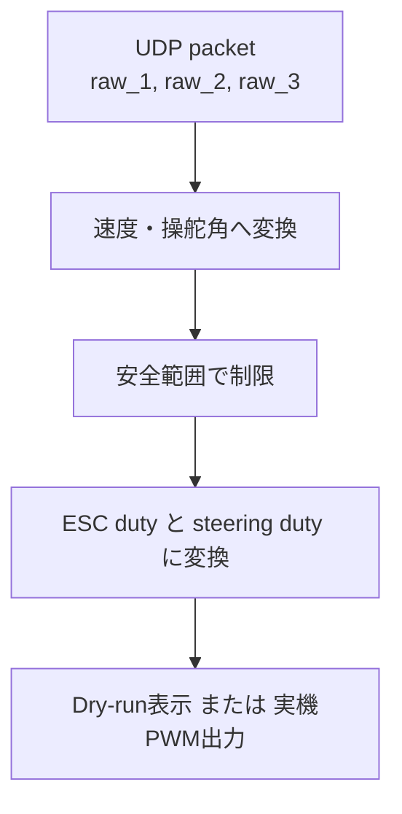

# RCカー UDP 通信の概要説明

対象ファイル:

- `OpenMiniCarWorks/UDP/legacy_double3_rc_pwm_receiver.py`

この資料は、RCカー実験で使っている UDP 通信の仕組みを、相手に説明しやすい形で整理したものです。
オプション一覧ではなく、**何が送られて、受信側でどう解釈され、最終的に車がどう動くか** を中心にまとめます。

---

## 1. 一言でいうと何をしているか

この仕組みは、PC 側で作った操縦指令を UDP で Raspberry Pi に送り、
Raspberry Pi 側でそれを **RCカー用の PWM 信号** に変換して、
実際のステアリングとモータへ出力するものです。

流れとしては次の通りです。

```text
Motive / Simulink / Python MPC
    ↓ UDP
Raspberry Pi
    ↓ PWM
RCカーの ESC とステアリングサーボ
```

---

## 2. この UDP 通信の役割

この UDP 通信は、Raspberry Pi に対して

- どれくらい前進したいか
- どちらにどれくらい曲がりたいか

を送るためのものです。

ただし、UDP で直接 PWM 値を送っているわけではありません。
送っているのは **旧形式の 3 つの実数値** で、Raspberry Pi 側がそれを解釈して PWM に変換します。

---

## 3. 送っているデータ形式

受信側スクリプトは、1 パケットを次の形式で受け取ります。

```text
float64 × 3
```

Python の表記では:

```python
FMT = "<ddd"
```

意味は次の通りです。

- `<` : リトルエンディアン
- `d` : 64 bit 浮動小数点数 (`float64`)
- `ddd` : 3 個並んでいる

したがって、1 パケットは

```text
[raw_1, raw_2, raw_3]
```

の 3 値です。

---

## 4. 3 つの値の意味

### `raw_1`

- 旧形式のモータ指令 1

### `raw_2`

- 旧形式のモータ指令 2

### `raw_3`

- 旧形式のサーボ指令
- 単位の扱いは `deg` として解釈している

受信側では、これらをそのまま PWM にしているのではなく、
一度「目標速度」と「目標操舵角」に変換してから、PWM に変えています。

---

## 5. 受信後に Raspberry Pi 側でやっていること

Raspberry Pi 側では、受け取った 3 値から次の 2 つを作ります。

- 目標速度 `target_speed_mps` [m/s]
- 目標操舵角 `target_steer_rad` [rad]

その後、

- ESC duty 比 [%]
- steering duty 比 [%]

に変換して、必要なら実機へ出力します。

流れを図にすると次の通りです。



---

## 6. 速度の作り方

まず、モータ指令 2 つの平均を取ります。

```text
legacy_motor_avg = 0.5 × (raw_1 + raw_2)
```

次に、これにスケール係数を掛けて目標速度を作ります。

```text
target_speed_mps = legacy_motor_avg × speed_per_legacy_unit
```

ここで `speed_per_legacy_unit` は、

- 旧モータ指令 1 単位を何 `m/s` とみなすか

を表す係数です。

たとえば:

```bash
--speed-per-legacy-unit 0.0090
```

なら、旧指令値の平均に `0.0090` を掛けて `m/s` に変えます。

---

## 7. 操舵角の作り方

旧サーボ値 `raw_3` から、まず目標操舵角 `deg` を作ります。

```text
target_steer_deg = legacy_steer_a × raw_3 + legacy_steer_b
```

次に、これを `rad` に変換します。

```text
target_steer_rad = radians(target_steer_deg)
```

つまり、送信側は「そのまま最終ステア角」を送っているのではなく、
**受信側で線形変換してから最終的な操舵角にしている**、という形です。

---

## 8. なぜすぐ PWM にせず、一度速度と操舵角にするのか

この構成の利点は、

- 上流の指令
- 実車の中立調整
- PWM 校正

を分けて扱いやすいことです。

たとえば、同じ UDP 入力でも受信側で

- 速度スケール
- 操舵中立
- ESC 中立
- 安全上限

を変えることで、実車側の調整ができます。

つまり、

```text
UDP の値 = 車にそのまま出す値
```

ではなく、

```text
UDP の値 = 受信側で解釈して使う途中の指令値
```

と考えるのが分かりやすいです。

---

## 9. 安全のための制限

受信側では、作った目標速度と目標操舵角をそのまま出さず、
安全のために上限で制限します。

### 速度制限

```text
0.0 m/s ～ max_speed_mps
```

の範囲に収めます。

### 操舵角制限

```text
-max_steer_rad ～ +max_steer_rad
```

の範囲に収めます。

このため、上流で大きすぎる値が来ても、受信側で安全側へ丸めることができます。

---

## 10. PWM への変換

### 10.1 ステアリング側

目標操舵角 `rad` から steering duty 比 `%` へ変換します。

現在の式は:

```text
steer_angle_rad = DUTY_FIT_A × steering_duty_percent + DUTY_FIT_B
```

受信側で実際に使う逆変換は:

```text
steering_duty_percent = (target_steer_rad - DUTY_FIT_B) / DUTY_FIT_A
```

現在の係数:

```text
DUTY_FIT_A = -0.186785136654
DUTY_FIT_B = 2.018473280947
```

### 10.2 ESC 側

目標速度 `m/s` から ESC duty 比 `%` へ変換します。

受信側で使っている式は:

```text
esc_duty_percent = (SPEED_FIT_BETA - target_speed_mps) / SPEED_FIT_ALPHA
```

現在の係数:

```text
SPEED_FIT_ALPHA = 2.4618
SPEED_FIT_BETA = 25.347
```

---

## 11. duty 比の意味

この系では、最終的に Raspberry Pi が出しているのは PWM の duty 比 `%` です。

代表値:

- ESC 中立: `10.300 %`
- ステアリング中立: `10.895 %`

特に ESC は、今回の整理では

- duty 比が小さいほど前進が強くなる

という扱いです。

したがって、

```text
10.300 % = 停止付近
10.100 % = より強い前進
```

という解釈になります。

---

## 12. 実際のログではどう見えるか

受信側は、受け取った値と変換後の値をログに出します。

例:

```text
PWM sender=192.168.11.2:57635 raw=(6.111111111, 6.111111111, 85.997574582) target_speed_mps=0.055000000 m/s target_steer_rad=0.000000000 rad target_steer_deg=0.0000 deg steering_duty=10.806391 % esc_duty=10.273783 % status=ok
```

この 1 行から、

- 送信元
- 生の UDP 値
- 目標速度 `m/s`
- 目標操舵角 `rad`, `deg`
- steering duty `%`
- ESC duty `%`
- その指令が正常かどうか

を確認できます。

---

## 13. `status` は何を表すか

`status` は、そのパケットがそのまま使えるか、制限や異常があるかを示します。

例:

- `ok`
- `clamped_speed`
- `clamped_steer`
- `negative_speed`
- `legacy_motor_mismatch`
- `invalid_neutral`
- `watchdog_neutral`
- `param_init_neutral`

説明:

- `ok` : 問題なし
- `clamped_speed` : 速度が上限を超えたので制限した
- `clamped_steer` : 操舵角が上限を超えたので制限した
- `negative_speed` : 後退側の値だった
- `legacy_motor_mismatch` : `raw_1` と `raw_2` が一致していない
- `watchdog_neutral` : 通信が止まったので中立へ戻した
- `param_init_neutral` : 初期化用パケットを中立とみなした

---

## 14. dry-run と実機出力の違い

このスクリプトは、通常は dry-run で使えます。

### dry-run

- UDP は受ける
- 計算結果は表示する
- 実機には PWM を出さない

### 実機出力あり

- UDP を受ける
- 計算結果を表示する
- 実際に ESC とステアリングへ PWM を出す

つまり、まず dry-run で通信と値の解釈を確認し、
その後に安全確認をしたうえで実機出力へ進める構成です。

---

## 15. この構成のよい点

この UDP 受信方式の利点は次の通りです。

1. 上流の制御計算と実機 PWM 出力を分離できる
2. dry-run でログ確認ができる
3. 実車の中立や安全範囲を受信側で調整できる
4. 通信断時に中立へ戻す安全処理を入れられる
5. 実験条件に応じて速度・操舵の上限を変えやすい

---

## 16. 相手に説明するときの簡単な言い方

相手に一言で説明するなら、次のように言うと分かりやすいです。

> PC 側で計算した「進め・曲がれ」の指令を UDP で Raspberry Pi に送り、
> Raspberry Pi 側でそれを実車用 PWM に変換して ESC とステアリングへ出しています。
> 受信側では中立補正や安全制限も入れていて、通信が止まったときは中立へ戻るようにしています。

もう少し丁寧に言うなら:

> UDP では旧形式の 3 つの実数値を送っています。
> Raspberry Pi 側はそれを速度 `m/s` と操舵角 `rad` に読み替えて、
> 校正式を使って ESC duty 比 `%` と steering duty 比 `%` に変換します。
> そのため、上流の制御と実車の PWM 校正を分けて扱えるようになっています。

---

## 17. 相手が誤解しやすい点

### 誤解 1: UDP で PWM 値を直接送っている

実際には違います。
送っているのは旧形式の 3 値で、PWM への変換は Raspberry Pi 側です。

### 誤解 2: `raw_1`, `raw_2`, `raw_3` がそのまま速度や角度である

これも厳密には違います。
受信側で係数を使って速度・操舵角へ変換しています。

### 誤解 3: 指令が来たら必ずそのまま出力される

違います。
安全範囲外なら制限または reject されます。
通信断時には中立へ戻ります。

---

## 18. 今後の実験で重要なこと

この UDP 通信自体が通っていても、実車が狙い通り走るとは限りません。
現在の実験では、特に次の整合が重要です。

1. OptiTrack / Motive のグラウンドプレーン設定
2. CS-200 による座標軸と原点の設定
3. Rigid Body の前方向定義
4. Simulink 内の座標変換
5. ゴール位置と参照軌道の解釈

つまり、UDP 通信が正常でも、
**座標系の解釈がずれていれば目標どおりの走行にはなりません。**

---

## 19. まとめ

この UDP 通信は、PC 側の制御結果を Raspberry Pi に渡し、
Raspberry Pi 側で実車用 PWM に変換して RCカーを動かすためのものです。

ポイントは次の 3 つです。

1. UDP で送るのは旧形式の 3 つの実数値
2. Raspberry Pi 側で速度・操舵角に変換してから PWM にする
3. 中立補正・上限制限・通信断時中立などの安全処理を入れている

この 3 点を押さえると、相手にも全体像を説明しやすくなります。
